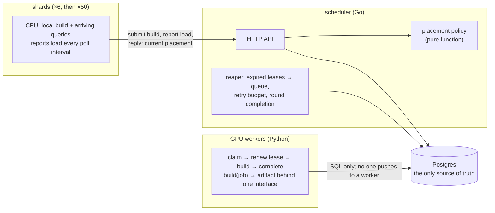

# Shard-to-GPU index build scheduler

A scheduler that places HNSW vector index builds from many database shards onto a small shared pool of GPU workers, or back onto each shard's own CPU, and measures which placement policy gets the whole cluster back to normal fastest.

**Status: Phase 1 in progress.** The lease-based scheduler, the Postgres schema and the GPU worker are built and tested under failure (worker killed mid-build, worker paused past its lease, concurrent claims, duplicate submits). Next: Docker Compose, the shard simulator, and the full failure suite at 6 and then 50 shards. The [roadmap](docs/roadmap.md) has all six phases.

## The problem

A sharded vector database receives one DDL: build an index on every shard. Each shard can build on its own CPU, which blocks the queries arriving at that shard until the build finishes, or hand the build to a shared GPU, which is faster but may already have a queue. Results are gathered from every shard, so the slowest shard sets the pace for the cluster.

Two pressures pull against each other:

- **Building locally blocks the shard.** The query backlog grows for as long as the CPU is busy.
- **Offloading to a saturated pool doesn't help.** If every GPU is busy, the build waits in a queue, and a local build might have finished sooner.

The metric is **round completion time**: from the DDL until every shard has built its index and drained the queries the build held up. The cluster's recovery time, reported as p50 and p99 over many seeded rounds.

The scheduler knows only what a real system could know: the build's size, the pool's state, and what each shard reports about its load. It never sees the future. A policy that does see the future exists only in the simulator, as an oracle to measure what not knowing costs.

## How it works



The properties the design is built around:

- **All shared state is in Postgres.** Every other process is stateless and can be killed at any time.
- **Workers pull.** A claim is one `UPDATE … FOR UPDATE SKIP LOCKED`. Nothing tracks which GPU is idle; an idle GPU announces itself by asking.
- **Leases with a fencing token.** Every claim increments `attempt`. Every later write is guarded by `build_id` and `attempt`, so a worker that was paused past its lease and wakes up cannot overwrite the result of the worker that replaced it.
- **An idempotent reaper.** Expired leases go back to the queue; running it twice changes nothing; a build whose lease keeps expiring is parked as failed after a retry budget instead of poisoning the pool.
- **Placement can change in flight.** A local build whose shard's backlog is growing can be preempted to the GPU queue with rising priority; a queued GPU build can be moved back to local. Shards learn of changes in the reply to their own report, never by push.
- **Policies are pure functions** of the state they are given, so the live scheduler and the discrete-event simulator run the same code.

## Repository

| Path | What |
| --- | --- |
| `scheduler/` | Go: HTTP API, placement policy, cost model, reaper, the store (every statement that touches the queue and leases) |
| `worker/` | Python: the GPU worker; `builder.py` is the one interface the fake, hnswlib and cuVS builders implement |
| `db/migrations/` | Postgres schema, applied in order on scheduler start |
| `shard/` | Go: the shard simulator (Phase 1, in progress) |
| `experiments/` | Seeded scenarios, discrete-event simulator, results (Phase 3) |
| `deploy/` | Docker Compose now; kind and Kubernetes manifests from Phase 2 |
| `docs/roadmap.md` | The plan: six phases, schema, policies, scenarios, failure tests |
| `docs/design/` | The design as built, one doc per phase: diagrams, flows, and an append-only table of every decision with the alternatives considered |
| `docs/bugs.md` | Significant bugs: symptom, cause, fix, what it would have looked like in production, lesson |
| `docs/tests.md` | Every test, with the scenario it checks in plain words |
| `test-logs/` | Narrated test output, saved per step |

## Testing

Tests narrate what they do and what Postgres holds at each step, so the logs read as a record of what happened. Two suites run against a throwaway Postgres container:

```
scripts/test-db.sh          # Go, then Python
scripts/test-db.sh --go     # or --py
```

Every step is also tested by an **independent cross-check agent** that reads the design docs and writes black-box tests without reading the implementation. Its tests live in `scheduler/crosscheck/` and run with the rest. Three of the five entries in the bug log were found that way, including a concurrency race in the per-round cap and a configuration error that crashed a worker with its lease held.

## Roadmap in one line each

1. **Scheduler with fake jobs** on Docker Compose; correct under `kill -9`, SIGSTOP, restart and duplicate submit. *(in progress)*
2. **Kubernetes on kind** with a stand-in GPU node, probes, graceful shutdown, Prometheus and Grafana.
3. **Placement policies and experiments:** always-GPU, static threshold, reactive migration, speculation, and a clairvoyant oracle, compared across six seeded scenarios in a discrete-event simulator.
4. **Real CPU builds with hnswlib**, an object store for vectors and artifacts, and a measured cost model.
5. **Real GPUs with cuVS** on a small cloud node pool: cold start, spot preemption, measured GPU numbers.
6. **Kubernetes-native dispatch** with a custom resource, an operator and Kueue, compared against the hand-built scheduler.

## Toolchain

Go 1.27, Python 3.12 with uv, Postgres 17, Docker. See the Commands section of `CLAUDE.md` for the exact commands.
