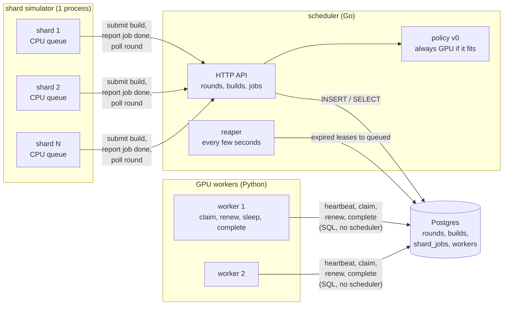
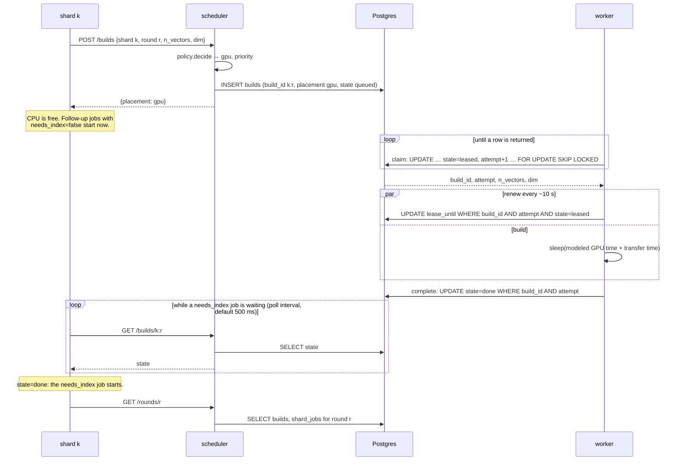
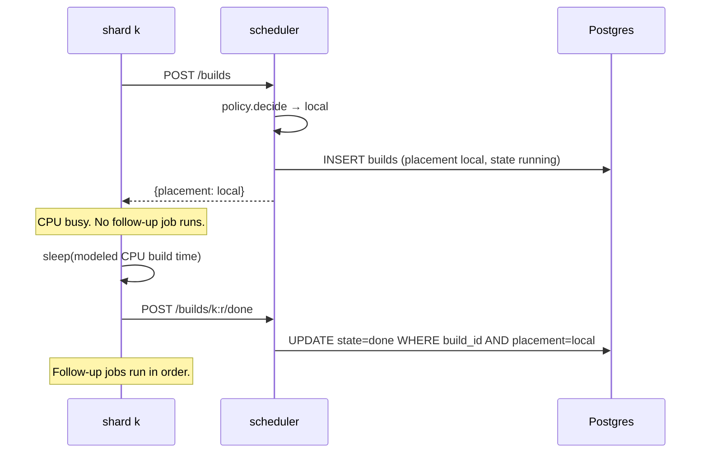
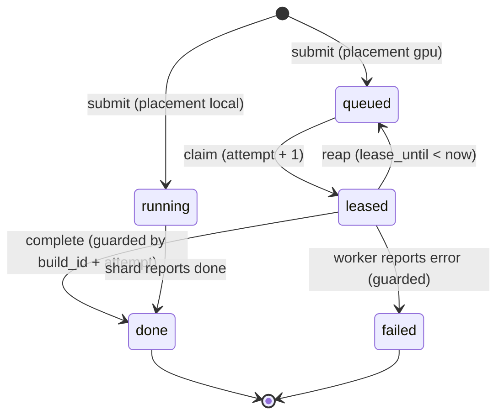
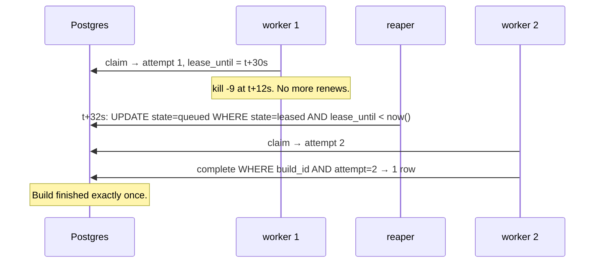

# Phase 1: scheduler with fake jobs

## Status and scope

**In progress.** Started 2026-10-01.

Build a scheduler that stays correct under failures, using builds that only sleep. Everything runs locally under Docker Compose. Default configuration: 6 shards, 2 GPU workers. The policy is the trivial one: every build goes to the GPU queue unless it does not fit in any worker's memory.

**Done when** a worker killed mid-build still results in that build finishing exactly once, at both 6 and 50 shards, and the other three failure tests pass (SIGSTOP past lease expiry, scheduler restart mid-round, duplicate submit).

## System diagram

Four kinds of process on one Docker network. Postgres is the only stateful one. The scheduler is the control plane; shards and workers are the data plane.

Two things to notice:

- **Shards talk to the scheduler. Workers talk to Postgres.** The scheduler must see every submission, because that is where the placement decision runs. Workers bypass it because the claim has to be one atomic SQL statement, and routing it through the scheduler would add a hop and a single point of failure to the hottest path for no benefit.
- **No arrows between the scheduler and the workers.** The scheduler never contacts a worker. Everything it wants a worker to do, it expresses by changing rows.

## Flows

### A GPU build, happy path

### A local build

### Build row state machine

`attempt` only changes on the `queued → leased` edge. Every edge out of `leased` is a conditional update on `build_id` and `attempt`. A worker whose update touches zero rows has lost the lease and stops.

### Failure: worker killed mid-build

The SIGSTOP variant is the same picture except worker 1 comes back: its renew and complete carry `attempt = 1`, match zero rows, and it abandons the build. That is the paused-process case fencing tokens exist for.

### Shard CPU queue

Each shard is a goroutine draining a sequential queue. The two rules from the modeling assumptions, drawn for one shard with three follow-up jobs where only the third needs the index:

```mermaid
gantt
    dateFormat X
    axisFormat %s
    section local build
    build on CPU            :a1, 0, 10
    job 1                   :a2, after a1, 3
    job 2                   :a3, after a2, 3
    job 3 (needs index)     :a4, after a3, 4
    section offloaded build
    build on GPU (queue + build) :b1, 0, 8
    job 1                   :b2, 0, 3
    job 2                   :b3, after b2, 3
    job 3 (needs index)     :b4, after b1, 4
```

Offloading lets jobs 1 and 2 overlap the build. Job 3 waits for whichever is later: the end of job 2 or the GPU build. If the GPU queue is long enough that the build finishes after time 10, offloading loses.

## Design decisions

| # | Decision | Alternatives | Why |
| --- | --- | --- | --- |
| 1 | Workers pull from a queue in Postgres | Scheduler pushes to an idle worker | Push needs a live view of every worker's state, which is exactly what was missing. A pull makes the request the idleness signal, and a dead worker's lease expires on its own. |
| 2 | Lease with a 30 s expiry plus a per-claim `attempt` counter as a fencing token | Lease only; or a distributed lock service | A lease alone cannot stop a paused worker from writing after it wakes. The counter makes every late write a no-op. Kleppmann's fencing-token argument. |
| 3 | All shared state in Postgres; every other process stateless | State in the scheduler's memory with periodic snapshots | A restart then costs nothing, and the scheduler-restart failure test is trivial. Postgres gives `SKIP LOCKED`, transactions and a partial index for the queue. |
| 4 | Shards call an HTTP API on the scheduler; workers use SQL directly | Both via API; or both via SQL | Placement must run in one place that sees every submission. The claim must be one atomic statement on the hottest path. See the note under the system diagram. |
| 5 | Local builds also get a `builds` row, in state `running` | Only GPU builds in the table | Three reasons. Round completion is computed from Postgres, so every shard's build must be there (invariant 1). The timeline and the per-placement metrics need every build's start and end in one place. Phase 3's reconsider and speculation read local builds in progress to pick one to copy to a GPU. The row is bookkeeping, not a queue entry: `running` is matched by neither the claim nor the reaper predicate, so workers and the reaper never see it. |
| 6 | A `workers` table with a heartbeat and a memory capacity | Derive pool size from leased rows | Idle workers are invisible in `builds`. Phase 3 policies need the live worker count, and it is one of the six missing pieces from the motivation. |
| 7 | Memory constraint enforced in the claim's `WHERE`, and at submit time against the largest live worker | A placement step that assigns a specific worker | Pull cannot target a GPU. Filtering in the claim is the only place the worker's own capacity is known. Submit-time check sends builds that fit nowhere to local. |
| 8 | Fake build = sleep for the cost model v0 time | Burn CPU for that long | Sleeping lets 50 shards and several workers run on one laptop. Phase 4 switches to real work. |
| 9 | The shard simulator drives rounds: it starts a round, submits every build, runs follow-up jobs, polls for completion | A separate experiment runner drives rounds | One fewer process in Phase 1. Phase 3 adds the runner and the simulator becomes a client of it. |
| 10 | Default 6 shards and 2 workers; 50 and 3 by config | Start at 50 | Small enough to read the full timeline by eye and debug. Nothing in the design depends on N. |
| 11 | Migrations are plain SQL files embedded in the Go binary and applied in filename order on process start, under an advisory lock, with applied versions recorded in `schema_migrations` | A migration library; a separate migrate command | One table set, few migrations, no dependency. Embedding means the scheduler image carries its own schema. The lock makes two replicas starting together safe. |
| 12 | One Go module at the repo root | One module per component | `scheduler/`, `shard/` and the simulator share the store and policy packages. Separate modules would need replace directives for no gain. |
| 13 | The worker's SQL (claim, renew, complete, fail, release, heartbeat) lives twice: in `scheduler/store` for Go and verbatim in the Python worker | One SQL file loaded by both | pgx and psycopg use different placeholder syntax (`$1` vs `%s`). The Go integration test is the reference; the Python copy must match it statement for statement, and a comment in each file points at the other. |
| 14 | State and placement rules are `CHECK` constraints in the schema, not only application logic | Trust the application | A row can never be `queued` with `placement = 'local'`, or `leased` without a lease. Bugs in any client fail loudly at the database. |
| 15 | `Release` (guarded move from `leased` back to `queued`) is in the store from day one | Add in Phase 2 with SIGTERM handling | It is one more guarded update and is tested alongside the others; Phase 2 only wires it to a signal. |
| 16 | `rounds.n_shards`: a round declares how many shards it expects (migration 0002) | The client closes the round explicitly | The scheduler can then tell "every shard is done" from "the shards seen so far are done", which matters once arrivals are staggered (Phase 3). Completion logic stays in Postgres. Chosen by the owner on 2026-10-02. |
| 17 | A shard declares its follow-up jobs in the same submit call as the build, and both are inserted in one transaction | Register jobs separately; or have the round creator declare every shard's workload up front | Phase 3's `decide` needs the job list as an input, so it must arrive with the build. One transaction means a build never exists without its jobs. |
| 18 | Round completion is computed by one idempotent `UPDATE` run on every reaper tick and before every `GET /rounds/{id}`; `finished_at` is the latest build or job finish, not the time of the check | Stamp the round in the handler that records the last completion | GPU completions happen over SQL from workers, so no handler sees them. Using the latest child finish makes the round duration independent of the tick interval. |
| 19 | With zero live workers, policy v0 still places on the GPU queue | Fall back to local when the pool is empty | "Nothing fits" is a statement about workers we can see. An empty pool may be cold-starting (Phase 5), and Compose start order should not turn a whole round local. The memory rule applies only when at least one worker is live. |
| 20 | Cost model v0 lives in `scheduler/costmodel` as pure functions of `n_vectors` and `dim`, with every constant overridable by env; the submit response returns the CPU and GPU estimates | Hard-code sleep times in the worker and shard | One source for the numbers the scheduler, shard and worker all need. The shard sleeps for `cpu_build_ms` on a local build; the Python worker reimplements the same formulas and must stay in step. |
| 21 | Standard-library HTTP only: `net/http` with Go 1.22 method-and-pattern routing, `encoding/json`, `log/slog` | A router or web framework | Eight routes do not justify a dependency. `DisallowUnknownFields` on request bodies catches client typos early. |
| 22 | Scheduler image is a two-stage build onto `distroless/static`, running as non-root | Alpine or Debian runtime image | The binary is static; distroless has no shell or package manager, so the attack surface and image size are minimal. Health checks therefore go through the HTTP endpoint, not a shell command. |
| 23 | A shard learns that its GPU build is done by polling `GET /builds/{id}` at a configurable interval, only while it has a `needs_index` job waiting and nothing else to run | Worker notifies the shard; scheduler pushes to the shard; long polling backed by `LISTEN/NOTIFY` | Workers talk only to Postgres, and the scheduler learns of GPU completions only from Postgres, so the shard asking is the only path that adds no new state or address book. The shard is blocked anyway, so polling costs it nothing. Added latency is at most one interval per shard and is recorded in the timeline so it is visible. OpenSearch's data nodes poll their remote build service the same way. Long polling is the upgrade if Phase 3 shows the artifact matters; the endpoint is shaped so the shard logic does not change. Chosen by the owner on 2026-10-02. |
| 24 | `started_at` on a build means "when the current attempt started"; reap and release clear it along with the lease columns, and `enqueued_at` keeps the submit time | Keep the first attempt's start | The timeline wants the winning attempt's duration, and work lost to abandoned attempts is `finished_at - enqueued_at` minus the last attempt. One column cannot hold both; this reading is simpler. (Cross-check gap 1.) |
| 25 | `Renew` has no `lease_until > now()` check: a worker that wakes after expiry but before the reaper acts may renew and continue | Reject renew once the deadline has passed | No one else owns the row until the reaper or a claimer acts, so continuing is safe and keeps the work. The lease is lost exactly when `attempt` stops matching. (Cross-check gap 2.) |
| 26 | "Fits" means `mem_bytes <= capacity`; a heartbeat with a new `mem_bytes` updates the worker's capacity; two simultaneous submits of one `build_id` yield exactly one `created:true` because the insert is `ON CONFLICT DO NOTHING` | | Stated so the spec says it. (Cross-check gaps 6, 8, 9.) |
| 27 | Submit validation: the round must exist (404); a new build is refused with 409 when the round already holds `n_shards` builds or has finished, enforced inside `SubmitBuild` under `SELECT … FOR UPDATE` on the round row; `n_shards` must be positive (400); a lease duration must be positive (store returns an error). `shard_id` is any non-negative integer. | Require `shard_id` in `0..n_shards-1` (the first version of this row) | Completion counts builds against `n_shards`, so the cap is what prevents an early finish. A dense id range was tried first and rejected the same day: both the implementer's and the cross-checker's tests had independently numbered shards 1-based or sparsely, which showed the range rule encoded an assumption the spec never made. The row lock serialises submits per round so the cap holds under concurrency. (Cross-check gaps 4, 8.) |

## Implementation notes

### Step 1: schema and the four operations (done 2026-10-02)

| Path | What |
| --- | --- |
| `db/migrations/0001_init.sql` | The four tables plus `CHECK` constraints, the queue index (partial, on `priority DESC, enqueued_at`) and the reaper index (partial, on `lease_until`). This file is now the schema reference; the roadmap's block is the original plan. |
| `db/migrate.go` | `db.Migrate(ctx, pool)`: embeds `migrations/*.sql`, applies unapplied files in order inside transactions, records them in `schema_migrations`, holds advisory lock `0x4B475055` for the run. |
| `scheduler/store/store.go` | `Store` with `CreateRound`, `SubmitBuild`, `Claim`, `Renew`, `Complete`, `Fail`, `Release`, `CompleteLocal`, `Reap`, `Heartbeat`, `LargestLiveWorkerMem`. Every post-claim write is guarded by `build_id AND attempt AND state = 'leased'` and returns a bool: false means the caller lost ownership. |
| `scheduler/store/store_test.go` | Integration tests, skipped without `TEST_DATABASE_URL`. |
| `scripts/test-db.sh` | Starts `postgres:17` in a container on a random port, runs `go test`, removes the container. Writes `test-logs/latest.log` (tracked, so the last run is visible on GitHub) and a timestamped copy in `test-logs/history/` (gitignored). The log has a header (date, commit, versions), the narrated test output, and the container's Docker events. |

What the tests prove, and which invariant each covers:

| Test | Shows |
| --- | --- |
| `ClaimOrdersByPriorityThenAge` | Queue order is priority desc, then enqueue time; attempt is 1 on first claim; empty queue returns nothing. |
| `ConcurrentClaimsNeverShareABuild` | 8 goroutines draining 20 builds: each claimed exactly once (`SKIP LOCKED`, invariant 2). |
| `FencingAfterReap` | Live lease is not reaped; expired lease is reaped once and a second reap changes nothing (invariant 5); the re-claim gets attempt 2 (invariant 4); the old owner's renew, complete and fail all match zero rows and leave the row untouched (invariant 3); a done row is never reaped. This is the SIGSTOP/SIGCONT scenario at the SQL level. |
| `ReleaseReturnsToQueueAndFences` | Release puts the build back; the next claim bumps attempt; the releasing owner cannot complete afterwards. |
| `ClaimRespectsWorkerMemory` | A small worker skips a high-priority build that does not fit and takes the next one; a big worker takes it (decision 7). |
| `DuplicateSubmitIsNoop` | Resubmitting with different priority and placement changes nothing, even mid-lease (invariant 6). |
| `LocalBuildsAreNeverReaped` | Local builds start `running`, cannot be claimed, are not reaped, and complete once (decision 5). |
| `HeartbeatAndLargestLiveWorker` | Upsert heartbeat; stale workers drop out of pool state. |

Lease length (30 s) and renew interval (10 s) are parameters of the calls, not constants in the store; the scheduler and worker configs will own them.

### Step 2: scheduler binary (done 2026-10-02)

| Path | What |
| --- | --- |
| `db/migrations/0002_rounds_n_shards.sql` | Adds `rounds.n_shards` (decision 16). |
| `scheduler/costmodel/` | Cost model v0 (decision 20). Defaults: 100k x 128 is about 20 s on CPU, 4 s on GPU plus 0.6 s transfer, 100 MiB of GPU memory. |
| `scheduler/policy/` | `Policy` interface and `AlwaysGPU` (decision 19). Pure; unit-tested without a database. |
| `scheduler/store/` | Added rounds, follow-up jobs, pool state, `FinishCompleteRounds`, `Reap` now reports which builds it touched (for the log). |
| `scheduler/api/` | The HTTP surface, table below. |
| `scheduler/reaper/` | `Run` ticks `Tick`: reap expired leases (one warning log line per build, with `build_id`, `attempt`, `round_id`, `lease_owner`), then finish complete rounds. |
| `scheduler/cmd/scheduler/` | `main`: env config, connect to Postgres with backoff retry, migrate, start reaper, serve HTTP, graceful shutdown on SIGTERM. |
| `scheduler/Dockerfile`, `.dockerignore` | Image build (decision 22). |

The API as built:

| Method | Path | Caller | Effect |
| --- | --- | --- | --- |
| POST | `/rounds` | shard simulator | `{scenario, seed, n_shards}` → 201 `{round_id}` |
| GET | `/rounds/{id}` | shard simulator | Finishes complete rounds, then returns the round, every build row and every job row |
| POST | `/builds` | shard | `{round_id, shard_id, n_vectors, dim, jobs:[{duration_ms, needs_index}]}` → 201 with `{build_id, placement, priority, reason, mem_bytes, cpu_build_ms, gpu_total_ms, created:true}`. A repeat returns 200 with `created:false`; every field but `reason` is computed from the stored row, whatever the repeat's body says (invariant 6). 404 for an unknown round; 409 for a new build when the round already holds `n_shards` builds or has finished (a duplicate still gets its 200). `shard_id` is any non-negative integer; the scheduler does not assume shards are numbered densely. |
| POST | `/builds/{id}/done` | shard | Local build finished. 409 unless the build is a running local build. |
| POST | `/jobs/{round}/{shard}/{seq}/start`, `/done` | shard | Record follow-up job timing. 404 if no such job, 409 if it exists but is not in the right state (start twice, done before start, done twice). |
| GET | `/workers` | anyone | Live pool state and every registered worker |
| GET | `/healthz` | Compose, Kubernetes | 200 when Postgres answers |

Tests added: `costmodel` (range and monotonicity), `policy` (the four placement cases and determinism), `store` (`RoundFinishesOnlyWhenEveryShardIsDone`, which walks a two-shard round through every partial state and checks the round is stamped only at the end, with `finished_at` equal to the last job's finish), `api` (`EndToEndRoundOverHTTP`: a two-shard round over HTTP with a GPU build claimed and completed through the store, a local build forced by memory, duplicate submit, job events, 409s, and round completion; `ValidationAndNotFound`).

### Cross-check of steps 1 and 2 (2026-10-02)

An independent agent (`.claude/agents/crosscheck-tester.md`, Opus, fresh context) wrote 14 black-box tests in `scheduler/crosscheck/` from the spec alone, without reading the implementation. 13 passed. The one failure and the gaps it reported, with what was done:

| Finding | Resolution |
| --- | --- |
| **Bug.** A duplicate `POST /builds` returned `cpu_build_ms` and `gpu_total_ms` computed from the repeat's request body while `mem_bytes` came from the stored row. A shard retrying with a different body would sleep for the wrong time. | Fixed: all estimates on a duplicate come from the stored row. The cross-check test now passes. |
| Which columns reap and release clear was unspecified; clearing `started_at` loses the first attempt's start. | Decision 24. |
| `Renew` succeeds on an expired-but-unreaped lease. | Intended; decision 25. |
| A failed GPU build leaves a `needs_index` job that can never start, so the round never finishes. | Open question below; fake builds cannot fail, so this is decided when real failures arrive (Phase 4). |
| `shard_id` not validated against `n_shards`; submits to a finished round accepted. | Fixed with a per-round cap rather than an id range; decision 27. |
| Job endpoints returned 409 for a nonexistent job. | Now 404; API table updated. |
| "Fits" boundary, heartbeat capacity change, concurrent duplicate submits unspecified. | Decision 26. |
| `reason` on a duplicate is not the original reason. | Not stored; the doc comment and API table now say so. |
| Stale duplicate API table in this doc. | Removed. |

Smoke test of the real binary: started before Postgres was ready (connect retry observed), migrated both files, answered `/healthz`, created a round, placed a build on the GPU queue with zero live workers (decision 19), and shut down cleanly on SIGTERM.

## Open questions

- **A failed GPU build and a waiting `needs_index` job.** `FinishCompleteRounds` treats `failed` as terminal, but the shard's job that needs the index can never start, so the round stays open forever. Resubmitting is a no-op by design. Candidates: the scheduler re-places a failed GPU build as local; or the shard marks dependent jobs skipped; or failed builds are retried once on the GPU. Decide in Phase 4, when the recall gate makes failure real. Raised by the cross-check.
- Polling for build completion (decision 23) adds up to one poll interval per shard to the round. Revisit with long polling if Phase 3 measurements show it matters.

- Should `failed` builds be retried automatically, or left for the shard to resubmit? Phase 1 leaves them; nothing fails in a fake build except a worker crash, which goes through reaping, not `failed`.
- Lease length and renew interval (30 s / 10 s) are placeholders. Phase 2's SIGTERM handling and Phase 5's preemption measurements will inform them.
