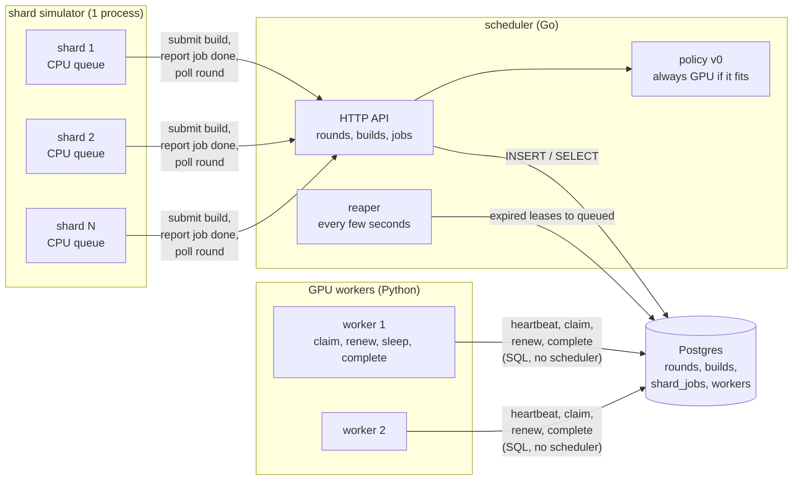
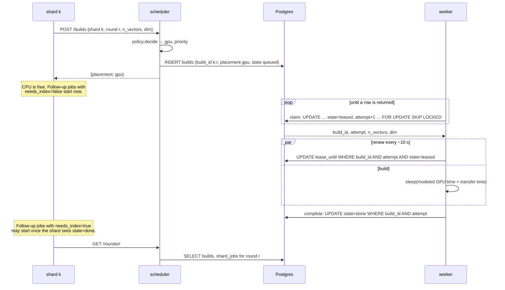
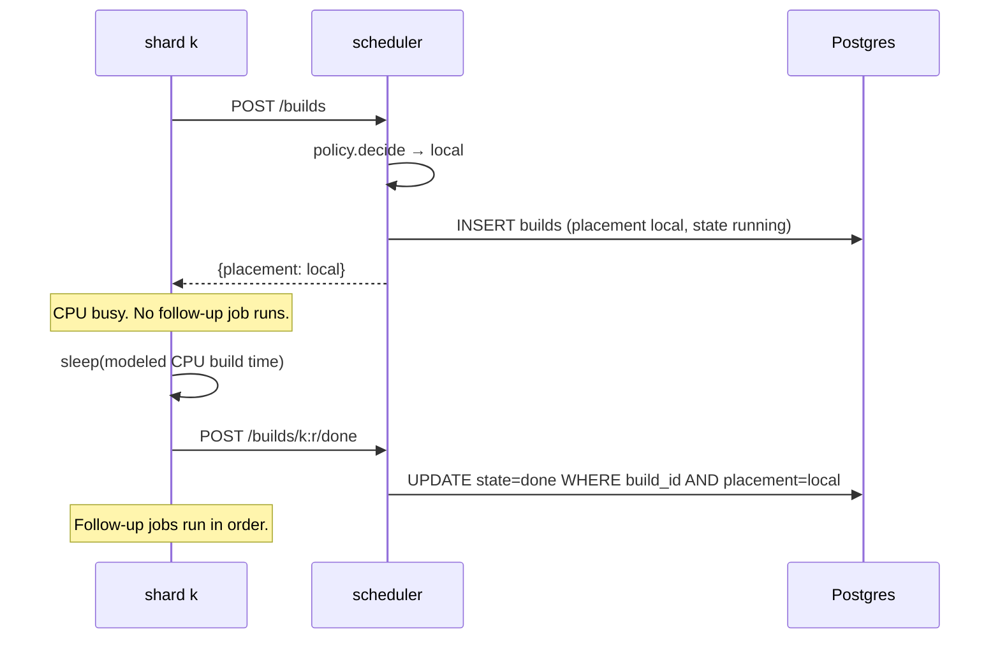
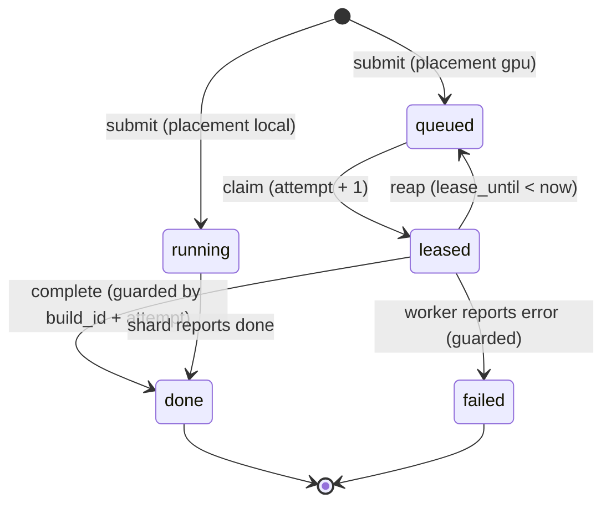
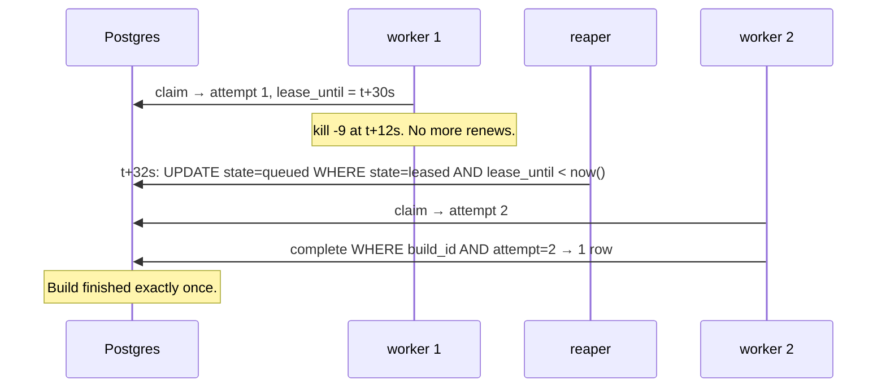

# Phase 1: scheduler with fake jobs

## Status and scope

**In progress.** Started 2026-10-01.

Build a scheduler that stays correct under failures, using builds that only sleep. Everything runs locally under Docker Compose. Default configuration: 6 shards, 2 GPU workers. The policy is the trivial one: every build goes to the GPU queue unless it does not fit in any worker's memory.

**Done when** a worker killed mid-build still results in that build finishing exactly once, at both 6 and 50 shards, and the other three failure tests pass (SIGSTOP past lease expiry, scheduler restart mid-round, duplicate submit).

## System diagram

Four kinds of process on one Docker network. Postgres is the only stateful one. The scheduler is the control plane; shards and workers are the data plane.

Two things to notice:

- **Shards talk to the scheduler. Workers talk to Postgres.** The scheduler must see every submission, because that is where the placement decision runs. Workers bypass it because the claim has to be one atomic SQL statement, and routing it through the scheduler would add a hop and a single point of failure to the hottest path for no benefit.
- **No arrows between the scheduler and the workers.** The scheduler never contacts a worker. Everything it wants a worker to do, it expresses by changing rows.

## Flows

### A GPU build, happy path

### A local build

### Build row state machine

`attempt` only changes on the `queued → leased` edge. Every edge out of `leased` is a conditional update on `build_id` and `attempt`. A worker whose update touches zero rows has lost the lease and stops.

### Failure: worker killed mid-build

The SIGSTOP variant is the same picture except worker 1 comes back: its renew and complete carry `attempt = 1`, match zero rows, and it abandons the build. That is the paused-process case fencing tokens exist for.

### Shard CPU queue

Each shard is a goroutine draining a sequential queue. The two rules from the modeling assumptions, drawn for one shard with three follow-up jobs where only the third needs the index:

```mermaid
gantt
    dateFormat X
    axisFormat %s
    section local build
    build on CPU            :a1, 0, 10
    job 1                   :a2, after a1, 3
    job 2                   :a3, after a2, 3
    job 3 (needs index)     :a4, after a3, 4
    section offloaded build
    build on GPU (queue + build) :b1, 0, 8
    job 1                   :b2, 0, 3
    job 2                   :b3, after b2, 3
    job 3 (needs index)     :b4, after b1, 4
```

Offloading lets jobs 1 and 2 overlap the build. Job 3 waits for whichever is later: the end of job 2 or the GPU build. If the GPU queue is long enough that the build finishes after time 10, offloading loses.

## Design decisions

| # | Decision | Alternatives | Why |
| --- | --- | --- | --- |
| 1 | Workers pull from a queue in Postgres | Scheduler pushes to an idle worker | Push needs a live view of every worker's state, which is exactly what was missing. A pull makes the request the idleness signal, and a dead worker's lease expires on its own. |
| 2 | Lease with a 30 s expiry plus a per-claim `attempt` counter as a fencing token | Lease only; or a distributed lock service | A lease alone cannot stop a paused worker from writing after it wakes. The counter makes every late write a no-op. Kleppmann's fencing-token argument. |
| 3 | All shared state in Postgres; every other process stateless | State in the scheduler's memory with periodic snapshots | A restart then costs nothing, and the scheduler-restart failure test is trivial. Postgres gives `SKIP LOCKED`, transactions and a partial index for the queue. |
| 4 | Shards call an HTTP API on the scheduler; workers use SQL directly | Both via API; or both via SQL | Placement must run in one place that sees every submission. The claim must be one atomic statement on the hottest path. See the note under the system diagram. |
| 5 | Local builds also get a `builds` row, in state `running` | Only GPU builds in the table | Round completion and the timeline then come from Postgres alone. `running` rather than `leased` keeps the reaper's predicate (`state = 'leased'`) from ever touching a local build. |
| 6 | A `workers` table with a heartbeat and a memory capacity | Derive pool size from leased rows | Idle workers are invisible in `builds`. Phase 3 policies need the live worker count, and it is one of the six missing pieces from the motivation. |
| 7 | Memory constraint enforced in the claim's `WHERE`, and at submit time against the largest live worker | A placement step that assigns a specific worker | Pull cannot target a GPU. Filtering in the claim is the only place the worker's own capacity is known. Submit-time check sends builds that fit nowhere to local. |
| 8 | Fake build = sleep for the cost model v0 time | Burn CPU for that long | Sleeping lets 50 shards and several workers run on one laptop. Phase 4 switches to real work. |
| 9 | The shard simulator drives rounds: it starts a round, submits every build, runs follow-up jobs, polls for completion | A separate experiment runner drives rounds | One fewer process in Phase 1. Phase 3 adds the runner and the simulator becomes a client of it. |
| 10 | Default 6 shards and 2 workers; 50 and 3 by config | Start at 50 | Small enough to read the full timeline by eye and debug. Nothing in the design depends on N. |
| 11 | Migrations are plain SQL files applied in filename order by a small Go command | A migration library | One table set, few migrations. Ask before adding a dependency. |

## Implementation notes

_(filled in as components land)_

### Schema

See `db/migrations/`. Four tables: `rounds`, `builds`, `shard_jobs`, `workers`. The SQL is in the roadmap's Phase 1 section and is the reference until the migration exists.

### API

_(to be written with the scheduler)_

| Method | Path | Caller | Effect |
| --- | --- | --- | --- |
| POST | `/rounds` | shard simulator | Insert a round; returns `round_id` |
| POST | `/builds` | shard | Run policy, insert build row, return placement. Idempotent on `build_id`. |
| POST | `/builds/{id}/done` | shard | Mark a local build done |
| POST | `/jobs/{round}/{shard}/{seq}/start` and `/done` | shard | Record follow-up job timing |
| GET | `/rounds/{id}` | shard simulator | Per-shard build and job status; `finished_at` once all done |

## Open questions

- Should `failed` builds be retried automatically, or left for the shard to resubmit? Phase 1 leaves them; nothing fails in a fake build except a worker crash, which goes through reaping, not `failed`.
- Lease length and renew interval (30 s / 10 s) are placeholders. Phase 2's SIGTERM handling and Phase 5's preemption measurements will inform them.
