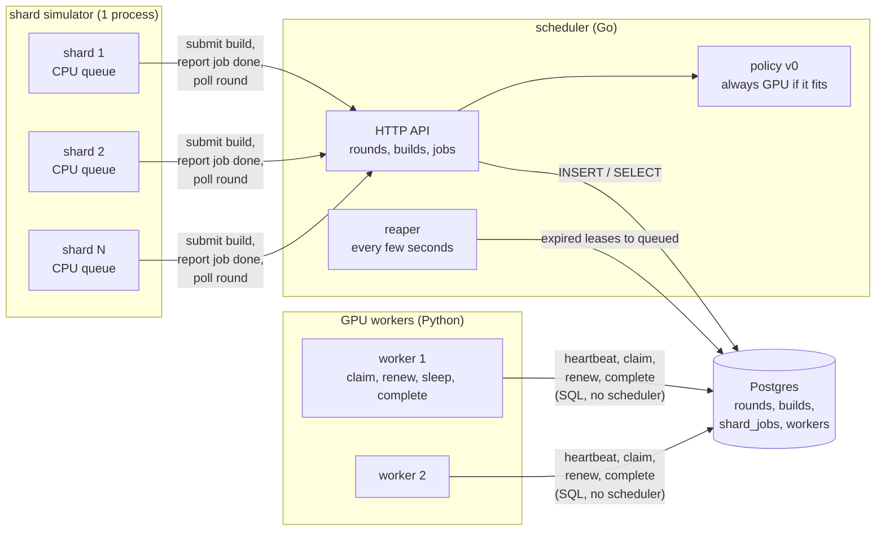
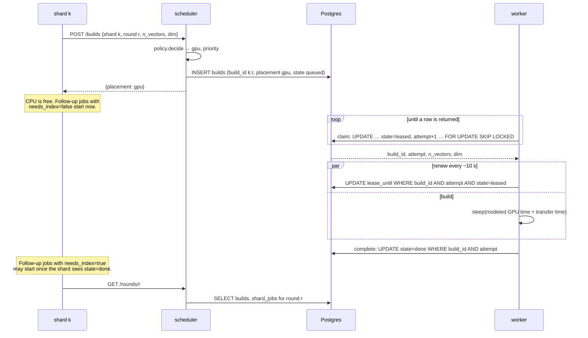
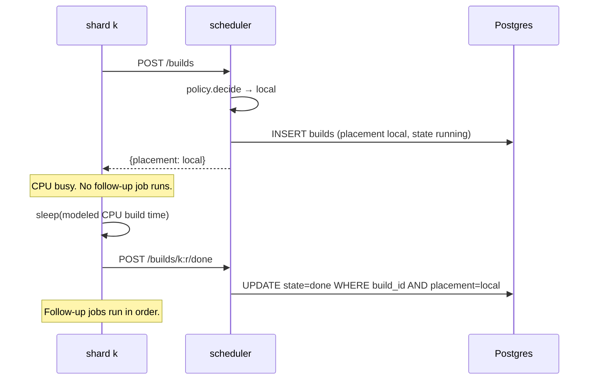
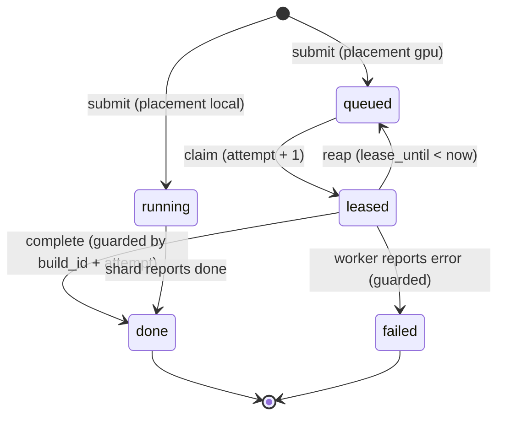
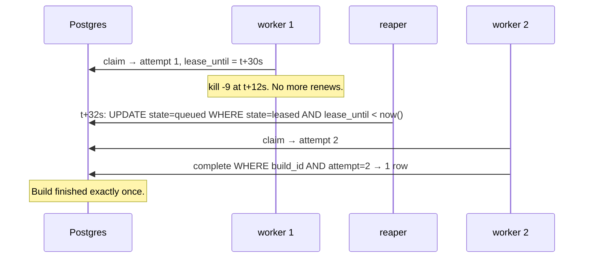

# Phase 1: scheduler with fake jobs

## Status and scope

**In progress.** Started 2026-10-01.

Build a scheduler that stays correct under failures, using builds that only sleep. Everything runs locally under Docker Compose. Default configuration: 6 shards, 2 GPU workers. The policy is the trivial one: every build goes to the GPU queue unless it does not fit in any worker's memory.

**Done when** a worker killed mid-build still results in that build finishing exactly once, at both 6 and 50 shards, and the other three failure tests pass (SIGSTOP past lease expiry, scheduler restart mid-round, duplicate submit).

## System diagram

Four kinds of process on one Docker network. Postgres is the only stateful one. The scheduler is the control plane; shards and workers are the data plane.

Two things to notice:

- **Shards talk to the scheduler. Workers talk to Postgres.** The scheduler must see every submission, because that is where the placement decision runs. Workers bypass it because the claim has to be one atomic SQL statement, and routing it through the scheduler would add a hop and a single point of failure to the hottest path for no benefit.
- **No arrows between the scheduler and the workers.** The scheduler never contacts a worker. Everything it wants a worker to do, it expresses by changing rows.

## Flows

### A GPU build, happy path

### A local build

### Build row state machine

`attempt` only changes on the `queued → leased` edge. Every edge out of `leased` is a conditional update on `build_id` and `attempt`. A worker whose update touches zero rows has lost the lease and stops.

### Failure: worker killed mid-build

The SIGSTOP variant is the same picture except worker 1 comes back: its renew and complete carry `attempt = 1`, match zero rows, and it abandons the build. That is the paused-process case fencing tokens exist for.

### Shard CPU queue

Each shard is a goroutine draining a sequential queue. The two rules from the modeling assumptions, drawn for one shard with three follow-up jobs where only the third needs the index:

```mermaid
gantt
    dateFormat X
    axisFormat %s
    section local build
    build on CPU            :a1, 0, 10
    job 1                   :a2, after a1, 3
    job 2                   :a3, after a2, 3
    job 3 (needs index)     :a4, after a3, 4
    section offloaded build
    build on GPU (queue + build) :b1, 0, 8
    job 1                   :b2, 0, 3
    job 2                   :b3, after b2, 3
    job 3 (needs index)     :b4, after b1, 4
```

Offloading lets jobs 1 and 2 overlap the build. Job 3 waits for whichever is later: the end of job 2 or the GPU build. If the GPU queue is long enough that the build finishes after time 10, offloading loses.

## Design decisions

| # | Decision | Alternatives | Why |
| --- | --- | --- | --- |
| 1 | Workers pull from a queue in Postgres | Scheduler pushes to an idle worker | Push needs a live view of every worker's state, which is exactly what was missing. A pull makes the request the idleness signal, and a dead worker's lease expires on its own. |
| 2 | Lease with a 30 s expiry plus a per-claim `attempt` counter as a fencing token | Lease only; or a distributed lock service | A lease alone cannot stop a paused worker from writing after it wakes. The counter makes every late write a no-op. Kleppmann's fencing-token argument. |
| 3 | All shared state in Postgres; every other process stateless | State in the scheduler's memory with periodic snapshots | A restart then costs nothing, and the scheduler-restart failure test is trivial. Postgres gives `SKIP LOCKED`, transactions and a partial index for the queue. |
| 4 | Shards call an HTTP API on the scheduler; workers use SQL directly | Both via API; or both via SQL | Placement must run in one place that sees every submission. The claim must be one atomic statement on the hottest path. See the note under the system diagram. |
| 5 | Local builds also get a `builds` row, in state `running` | Only GPU builds in the table | Three reasons. Round completion is computed from Postgres, so every shard's build must be there (invariant 1). The timeline and the per-placement metrics need every build's start and end in one place. Phase 3's reconsider and speculation read local builds in progress to pick one to copy to a GPU. The row is bookkeeping, not a queue entry: `running` is matched by neither the claim nor the reaper predicate, so workers and the reaper never see it. |
| 6 | A `workers` table with a heartbeat and a memory capacity | Derive pool size from leased rows | Idle workers are invisible in `builds`. Phase 3 policies need the live worker count, and it is one of the six missing pieces from the motivation. |
| 7 | Memory constraint enforced in the claim's `WHERE`, and at submit time against the largest live worker | A placement step that assigns a specific worker | Pull cannot target a GPU. Filtering in the claim is the only place the worker's own capacity is known. Submit-time check sends builds that fit nowhere to local. |
| 8 | Fake build = sleep for the cost model v0 time | Burn CPU for that long | Sleeping lets 50 shards and several workers run on one laptop. Phase 4 switches to real work. |
| 9 | The shard simulator drives rounds: it starts a round, submits every build, runs follow-up jobs, polls for completion | A separate experiment runner drives rounds | One fewer process in Phase 1. Phase 3 adds the runner and the simulator becomes a client of it. |
| 10 | Default 6 shards and 2 workers; 50 and 3 by config | Start at 50 | Small enough to read the full timeline by eye and debug. Nothing in the design depends on N. |
| 11 | Migrations are plain SQL files embedded in the Go binary and applied in filename order on process start, under an advisory lock, with applied versions recorded in `schema_migrations` | A migration library; a separate migrate command | One table set, few migrations, no dependency. Embedding means the scheduler image carries its own schema. The lock makes two replicas starting together safe. |
| 12 | One Go module at the repo root | One module per component | `scheduler/`, `shard/` and the simulator share the store and policy packages. Separate modules would need replace directives for no gain. |
| 13 | The worker's SQL (claim, renew, complete, fail, release, heartbeat) lives twice: in `scheduler/store` for Go and verbatim in the Python worker | One SQL file loaded by both | pgx and psycopg use different placeholder syntax (`$1` vs `%s`). The Go integration test is the reference; the Python copy must match it statement for statement, and a comment in each file points at the other. |
| 14 | State and placement rules are `CHECK` constraints in the schema, not only application logic | Trust the application | A row can never be `queued` with `placement = 'local'`, or `leased` without a lease. Bugs in any client fail loudly at the database. |
| 15 | `Release` (guarded move from `leased` back to `queued`) is in the store from day one | Add in Phase 2 with SIGTERM handling | It is one more guarded update and is tested alongside the others; Phase 2 only wires it to a signal. |

## Implementation notes

### Step 1: schema and the four operations (done 2026-10-02)

| Path | What |
| --- | --- |
| `db/migrations/0001_init.sql` | The four tables plus `CHECK` constraints, the queue index (partial, on `priority DESC, enqueued_at`) and the reaper index (partial, on `lease_until`). This file is now the schema reference; the roadmap's block is the original plan. |
| `db/migrate.go` | `db.Migrate(ctx, pool)`: embeds `migrations/*.sql`, applies unapplied files in order inside transactions, records them in `schema_migrations`, holds advisory lock `0x4B475055` for the run. |
| `scheduler/store/store.go` | `Store` with `CreateRound`, `SubmitBuild`, `Claim`, `Renew`, `Complete`, `Fail`, `Release`, `CompleteLocal`, `Reap`, `Heartbeat`, `LargestLiveWorkerMem`. Every post-claim write is guarded by `build_id AND attempt AND state = 'leased'` and returns a bool: false means the caller lost ownership. |
| `scheduler/store/store_test.go` | Integration tests, skipped without `TEST_DATABASE_URL`. |
| `scripts/test-db.sh` | Starts `postgres:17` in a container on a random port, runs `go test`, removes the container. |

What the tests prove, and which invariant each covers:

| Test | Shows |
| --- | --- |
| `ClaimOrdersByPriorityThenAge` | Queue order is priority desc, then enqueue time; attempt is 1 on first claim; empty queue returns nothing. |
| `ConcurrentClaimsNeverShareABuild` | 8 goroutines draining 20 builds: each claimed exactly once (`SKIP LOCKED`, invariant 2). |
| `FencingAfterReap` | Live lease is not reaped; expired lease is reaped once and a second reap changes nothing (invariant 5); the re-claim gets attempt 2 (invariant 4); the old owner's renew, complete and fail all match zero rows and leave the row untouched (invariant 3); a done row is never reaped. This is the SIGSTOP/SIGCONT scenario at the SQL level. |
| `ReleaseReturnsToQueueAndFences` | Release puts the build back; the next claim bumps attempt; the releasing owner cannot complete afterwards. |
| `ClaimRespectsWorkerMemory` | A small worker skips a high-priority build that does not fit and takes the next one; a big worker takes it (decision 7). |
| `DuplicateSubmitIsNoop` | Resubmitting with different priority and placement changes nothing, even mid-lease (invariant 6). |
| `LocalBuildsAreNeverReaped` | Local builds start `running`, cannot be claimed, are not reaped, and complete once (decision 5). |
| `HeartbeatAndLargestLiveWorker` | Upsert heartbeat; stale workers drop out of pool state. |

Lease length (30 s) and renew interval (10 s) are parameters of the calls, not constants in the store; the scheduler and worker configs will own them.

### API

_(to be written with the scheduler)_

| Method | Path | Caller | Effect |
| --- | --- | --- | --- |
| POST | `/rounds` | shard simulator | Insert a round; returns `round_id` |
| POST | `/builds` | shard | Run policy, insert build row, return placement. Idempotent on `build_id`. |
| POST | `/builds/{id}/done` | shard | Mark a local build done |
| POST | `/jobs/{round}/{shard}/{seq}/start` and `/done` | shard | Record follow-up job timing |
| GET | `/rounds/{id}` | shard simulator | Per-shard build and job status; `finished_at` once all done |

## Open questions

- Should `failed` builds be retried automatically, or left for the shard to resubmit? Phase 1 leaves them; nothing fails in a fake build except a worker crash, which goes through reaping, not `failed`.
- Lease length and renew interval (30 s / 10 s) are placeholders. Phase 2's SIGTERM handling and Phase 5's preemption measurements will inform them.
