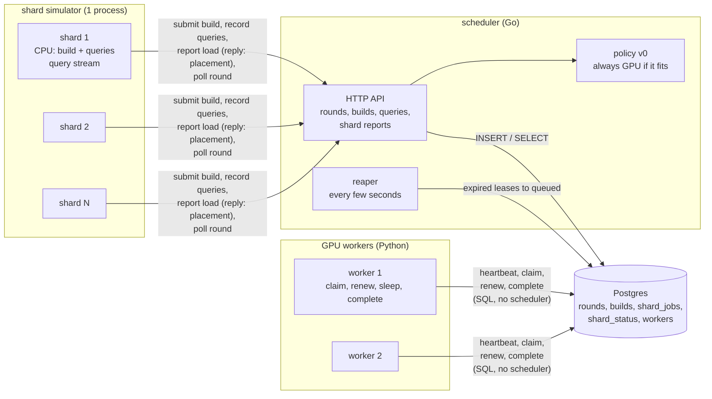
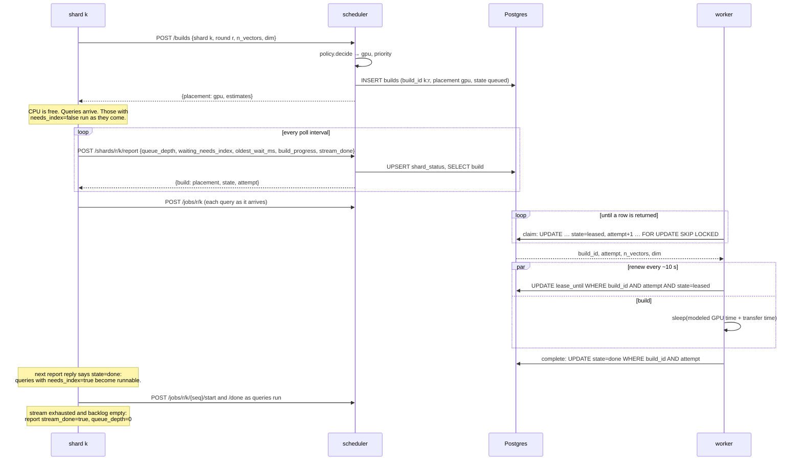
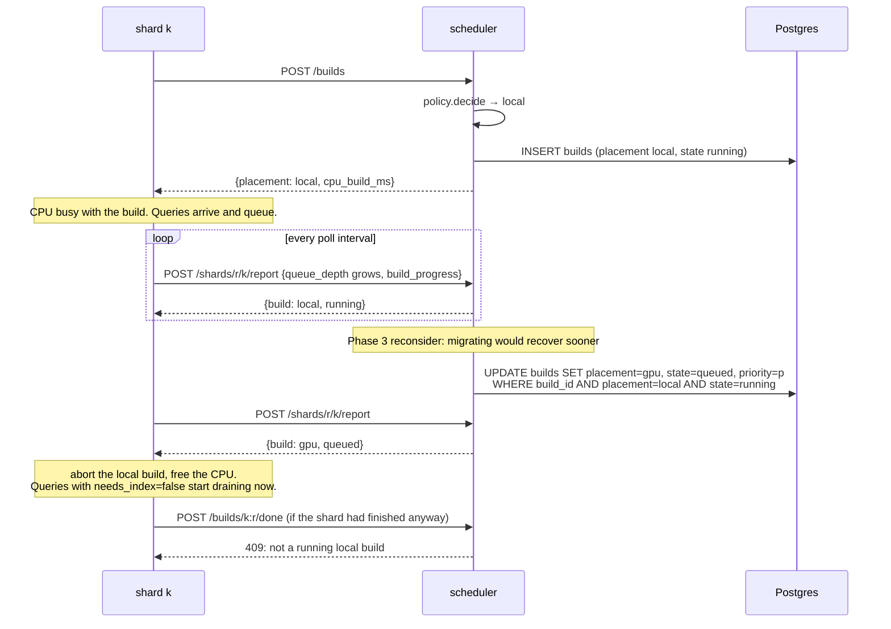
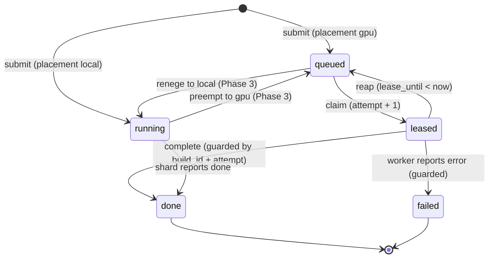
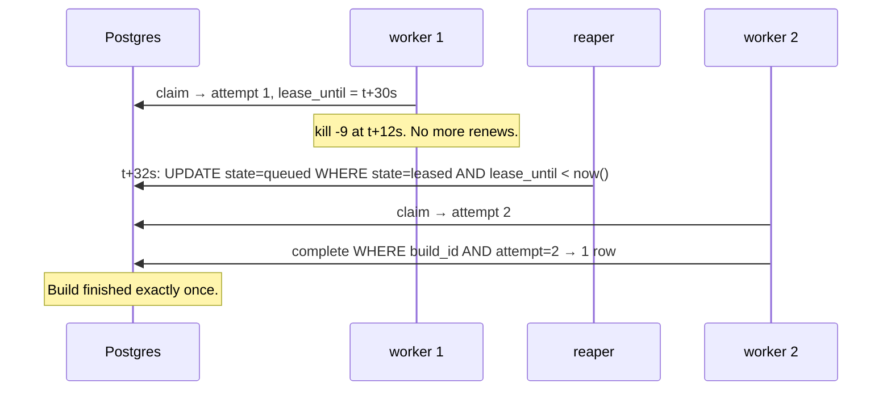

# Phase 1: scheduler with fake jobs

## Status and scope

**In progress.** Started 2026-10-01.

Build a scheduler that stays correct under failures, using builds that only sleep. Everything runs locally under Docker Compose. Default configuration: 6 shards, 2 GPU workers. The policy is the trivial one: every build goes to the GPU queue unless it does not fit in any worker's memory.

**Model revision, 2026-10-02.** The first version of this doc had each shard declare its follow-up jobs at submit time. The owner pointed out that a real shard receiving a DDL knows nothing about the queries to come, so a policy fed that list would be using information no production scheduler has. The model is now: queries arrive over the round as a seeded stream; the shard records each one as it arrives and reports its load periodically; placement can change in flight (preemption of a local build, reneging of a queued GPU build), and the shard learns of changes in the reply to its own report. Decisions 28 onward record the revision; decision 17 is superseded.

**Done when** a worker killed mid-build still results in that build finishing exactly once, at both 6 and 50 shards, and the other three failure tests pass (SIGSTOP past lease expiry, scheduler restart mid-round, duplicate submit).

## System diagram

Four kinds of process on one Docker network. Postgres is the only stateful one. The scheduler is the control plane; shards and workers are the data plane.

Two things to notice:

- **Shards talk to the scheduler. Workers talk to Postgres.** The scheduler must see every submission, because that is where the placement decision runs. Workers bypass it because the claim has to be one atomic SQL statement, and routing it through the scheduler would add a hop and a single point of failure to the hottest path for no benefit.
- **No arrows between the scheduler and the workers.** The scheduler never contacts a worker. Everything it wants a worker to do, it expresses by changing rows.

## Flows

### A GPU build, happy path

### A local build, and its preemption

In Phase 1 the policy never preempts, but the transition, the report path and the shard's reaction exist so the simulator is built right.

### Build row state machine

`attempt` only changes on the `queued → leased` edge. Every edge out of `leased` is a conditional update on `build_id` and `attempt`. A worker whose update touches zero rows has lost the lease and stops. The two Phase 3 edges flip `placement` as well as `state`; a shard whose local build was preempted finds out because its `done` call is refused, or earlier from its report reply.

### Failure: worker killed mid-build

The SIGSTOP variant is the same picture except worker 1 comes back: its renew and complete carry `attempt = 1`, match zero rows, and it abandons the build. That is the paused-process case fencing tokens exist for.

### Shard CPU, and how the queue grows

Each shard is a goroutine with one CPU. Queries arrive from its seeded stream at rate λ. The CPU runs one thing at a time: the local build if there is one, otherwise the oldest ready query. A query is ready if it doesn't need the index, or the index is built. Drawn for one shard with a 10 s build and four queries, two of which need the index:

```mermaid
gantt
    dateFormat X
    axisFormat %s
    section local build
    build on CPU            :a1, 0, 10
    q1 (arrived 1)          :a2, after a1, 2
    q2 needs idx (arr 3)    :a3, after a2, 2
    q3 (arrived 5)          :a4, after a3, 2
    q4 needs idx (arr 7)    :a5, after a4, 2
    section offloaded build
    build on GPU (queue + build) :b1, 0, 8
    q1 (arrived 1)          :b2, 1, 2
    q3 (arrived 5)          :b3, 5, 2
    q2 needs idx (arr 3)    :b4, after b1, 2
    q4 needs idx (arr 7)    :b5, after b4, 2
```

Local: the backlog grows at λ for the whole build, then drains at (service rate − λ). Everything waits, including queries that never needed the index. Offloaded: q1 and q3 run on arrival; q2 and q4 wait for the GPU. The shard recovers at 12 instead of 18. If the GPU queue were long enough that the build finished after 14 or so, local would win. The report carries exactly what this picture needs: queue depth, how many waiting queries need the index, how long the oldest has waited, and how far the local build has got.

## Design decisions

| # | Decision | Alternatives | Why |
| --- | --- | --- | --- |
| 1 | Workers pull from a queue in Postgres | Scheduler pushes to an idle worker | Push needs a live view of every worker's state, which is exactly what was missing. A pull makes the request the idleness signal, and a dead worker's lease expires on its own. |
| 2 | Lease with a 30 s expiry plus a per-claim `attempt` counter as a fencing token | Lease only; or a distributed lock service | A lease alone cannot stop a paused worker from writing after it wakes. The counter makes every late write a no-op. Kleppmann's fencing-token argument. |
| 3 | All shared state in Postgres; every other process stateless | State in the scheduler's memory with periodic snapshots | A restart then costs nothing, and the scheduler-restart failure test is trivial. Postgres gives `SKIP LOCKED`, transactions and a partial index for the queue. |
| 4 | Shards call an HTTP API on the scheduler; workers use SQL directly | Both via API; or both via SQL | Placement must run in one place that sees every submission. The claim must be one atomic statement on the hottest path. See the note under the system diagram. |
| 5 | Local builds also get a `builds` row, in state `running` | Only GPU builds in the table | Three reasons. Round completion is computed from Postgres, so every shard's build must be there (invariant 1). The timeline and the per-placement metrics need every build's start and end in one place. Phase 3's reconsider and speculation read local builds in progress to pick one to copy to a GPU. The row is bookkeeping, not a queue entry: `running` is matched by neither the claim nor the reaper predicate, so workers and the reaper never see it. |
| 6 | A `workers` table with a heartbeat and a memory capacity | Derive pool size from leased rows | Idle workers are invisible in `builds`. Phase 3 policies need the live worker count, and it is one of the six missing pieces from the motivation. |
| 7 | Memory constraint enforced in the claim's `WHERE`, and at submit time against the largest live worker | A placement step that assigns a specific worker | Pull cannot target a GPU. Filtering in the claim is the only place the worker's own capacity is known. Submit-time check sends builds that fit nowhere to local. |
| 8 | Fake build = sleep for the cost model v0 time | Burn CPU for that long | Sleeping lets 50 shards and several workers run on one laptop. Phase 4 switches to real work. |
| 9 | The shard simulator drives rounds: it starts a round, submits every build, runs follow-up jobs, polls for completion | A separate experiment runner drives rounds | One fewer process in Phase 1. Phase 3 adds the runner and the simulator becomes a client of it. |
| 10 | Default 6 shards and 2 workers; 50 and 3 by config | Start at 50 | Small enough to read the full timeline by eye and debug. Nothing in the design depends on N. |
| 11 | Migrations are plain SQL files embedded in the Go binary and applied in filename order on process start, under an advisory lock, with applied versions recorded in `schema_migrations` | A migration library; a separate migrate command | One table set, few migrations, no dependency. Embedding means the scheduler image carries its own schema. The lock makes two replicas starting together safe. |
| 12 | One Go module at the repo root | One module per component | `scheduler/`, `shard/` and the simulator share the store and policy packages. Separate modules would need replace directives for no gain. |
| 13 | The worker's SQL (claim, renew, complete, fail, release, heartbeat) lives twice: in `scheduler/store` for Go and verbatim in the Python worker | One SQL file loaded by both | pgx and psycopg use different placeholder syntax (`$1` vs `%s`). The Go integration test is the reference; the Python copy must match it statement for statement, and a comment in each file points at the other. |
| 14 | State and placement rules are `CHECK` constraints in the schema, not only application logic | Trust the application | A row can never be `queued` with `placement = 'local'`, or `leased` without a lease. Bugs in any client fail loudly at the database. |
| 15 | `Release` (guarded move from `leased` back to `queued`) is in the store from day one | Add in Phase 2 with SIGTERM handling | It is one more guarded update and is tested alongside the others; Phase 2 only wires it to a signal. |
| 16 | `rounds.n_shards`: a round declares how many shards it expects (migration 0002) | The client closes the round explicitly | The scheduler can then tell "every shard is done" from "the shards seen so far are done", which matters once arrivals are staggered (Phase 3). Completion logic stays in Postgres. Chosen by the owner on 2026-10-02. |
| 17 | ~~A shard declares its follow-up jobs in the same submit call as the build~~ **Superseded by 28.** | | Declared future work is information a real shard does not have. |
| 18 | Round completion is computed by one idempotent `UPDATE` run on every reaper tick and before every `GET /rounds/{id}`; `finished_at` is the latest build or job finish, not the time of the check | Stamp the round in the handler that records the last completion | GPU completions happen over SQL from workers, so no handler sees them. Using the latest child finish makes the round duration independent of the tick interval. |
| 19 | With zero live workers, policy v0 still places on the GPU queue | Fall back to local when the pool is empty | "Nothing fits" is a statement about workers we can see. An empty pool may be cold-starting (Phase 5), and Compose start order should not turn a whole round local. The memory rule applies only when at least one worker is live. |
| 20 | Cost model v0 lives in `scheduler/costmodel` as pure functions of `n_vectors` and `dim`, with every constant overridable by env; the submit response returns the CPU and GPU estimates | Hard-code sleep times in the worker and shard | One source for the numbers the scheduler, shard and worker all need. The shard sleeps for `cpu_build_ms` on a local build; the Python worker reimplements the same formulas and must stay in step. |
| 21 | Standard-library HTTP only: `net/http` with Go 1.22 method-and-pattern routing, `encoding/json`, `log/slog` | A router or web framework | Eight routes do not justify a dependency. `DisallowUnknownFields` on request bodies catches client typos early. |
| 22 | Scheduler image is a two-stage build onto `distroless/static`, running as non-root | Alpine or Debian runtime image | The binary is static; distroless has no shell or package manager, so the attack surface and image size are minimal. Health checks therefore go through the HTTP endpoint, not a shell command. |
| 23 | A shard learns that its GPU build is done by polling `GET /builds/{id}` at a configurable interval, only while it has a `needs_index` job waiting and nothing else to run | Worker notifies the shard; scheduler pushes to the shard; long polling backed by `LISTEN/NOTIFY` | Workers talk only to Postgres, and the scheduler learns of GPU completions only from Postgres, so the shard asking is the only path that adds no new state or address book. The shard is blocked anyway, so polling costs it nothing. Added latency is at most one interval per shard and is recorded in the timeline so it is visible. OpenSearch's data nodes poll their remote build service the same way. Long polling is the upgrade if Phase 3 shows the artifact matters; the endpoint is shaped so the shard logic does not change. Chosen by the owner on 2026-10-02. |
| 24 | `started_at` on a build means "when the current attempt started"; reap and release clear it along with the lease columns, and `enqueued_at` keeps the submit time | Keep the first attempt's start | The timeline wants the winning attempt's duration, and work lost to abandoned attempts is `finished_at - enqueued_at` minus the last attempt. One column cannot hold both; this reading is simpler. (Cross-check gap 1.) |
| 25 | `Renew` has no `lease_until > now()` check: a worker that wakes after expiry but before the reaper acts may renew and continue | Reject renew once the deadline has passed | No one else owns the row until the reaper or a claimer acts, so continuing is safe and keeps the work. The lease is lost exactly when `attempt` stops matching. (Cross-check gap 2.) |
| 26 | "Fits" means `mem_bytes <= capacity`; a heartbeat with a new `mem_bytes` updates the worker's capacity; two simultaneous submits of one `build_id` yield exactly one `created:true` because the insert is `ON CONFLICT DO NOTHING` | | Stated so the spec says it. (Cross-check gaps 6, 8, 9.) |
| 27 | Submit validation: the round must exist (404); a new build is refused with 409 when the round already holds `n_shards` builds or has finished, enforced inside `SubmitBuild` under `SELECT … FOR UPDATE` on the round row; `n_shards` must be positive (400); a lease duration must be positive (store returns an error). `shard_id` is any non-negative integer. | Require `shard_id` in `0..n_shards-1` (the first version of this row) | Completion counts builds against `n_shards`, so the cap is what prevents an early finish. A dense id range was tried first and rejected the same day: both the implementer's and the cross-checker's tests had independently numbered shards 1-based or sparsely, which showed the range rule encoded an assumption the spec never made. The row lock serialises submits per round so the cap holds under concurrency. (Cross-check gaps 4, 8.) |
| 28 | **Queries are an arriving stream, not a declared list.** The shard records each query when it arrives (`POST /jobs/{round}/{shard}`), the submit call carries no jobs, and the policy sees only the shard's reports | Declare jobs at submit (decision 17) | A shard receiving a DDL knows the build's size and nothing about the queries to come. A policy fed the future would be an oracle, not a scheduler. The simulator still knows the future and gives it only to the clairvoyant policy, to measure what not knowing costs. Owner's call, 2026-10-02. |
| 29 | **The shard's periodic report is its sync point.** `POST /shards/{round}/{shard}/report` upserts `shard_status` and replies with the build's current placement, state and attempt. The shard acts on the reply: abort a preempted local build, start a build moved to local, run `needs_index` queries once the build is done | Separate polling (decision 23) plus a push channel for placement changes | One call, one direction, no push, no address book. The scheduler learns the shard's load and the shard learns the scheduler's decision in the same round trip. Decision 23's `GET /builds/{id}` remains for debugging and tests. |
| 30 | **Finite query stream per round.** The generator produces a seeded, finite sequence per shard; the shard reports `stream_done` when exhausted. Round completion = `n_shards` shards with `stream_done`, all their queries finished, all builds terminal | Continuous stream with a "recovered to steady state" criterion | Deterministic and simple to end. Realism beyond this needs real load data, which does not exist yet; the point is to have thought through how the queue grows, not to model production traffic. Owner's call, 2026-10-02. |
| 31 | **In-flight placement changes are two more guarded transitions.** Preempt: `running` → `queued` with `placement` flipped to `gpu`, `started_at` cleared, `priority` set, guarded by `placement = 'local' AND state = 'running'`. Renege: `queued` → `running` with `placement` flipped to `local` and `started_at` set to now, guarded by `placement = 'gpu' AND state = 'queued'`. A `leased` build is never moved. `attempt` and `enqueued_at` are untouched by both: the first claim bumps `attempt`, and `enqueued_at` keeps the submit time for the timeline (decision 24), so a preempted build sorts among equal priorities by its original submit time | Cancel and resubmit under a new id | Same row, same idempotency key, same timeline. The guards make a change race-free against a concurrent claim or completion, and a shard that didn't notice a preemption is refused at `done` by the existing guard. Phase 1 ships the transitions and tests them; Phase 3 ships the policy that uses them. |
| 32 | **Queue semantics on the shard:** one CPU, runs the local build if any, else the oldest ready query; a query is ready if it doesn't need the index or the index is built; queries that aren't ready wait without blocking others | Strict FIFO where a `needs_index` query at the head blocks everything behind it | Sessions in a real database are independent; a blocked one doesn't block the rest. This also makes "freeing the CPU" worth something even when some queries need the index. |
| 33 | **Only shards that submitted take part in a round.** A report or an arrival from a shard with no build in the round is refused (`ErrNoBuild`, 404 over HTTP); `FinishCompleteRounds` counts `stream_done` only for shards that have a build; `stream_done` is sticky (a later report cannot withdraw it); an arrival after `stream_done` is refused (`ErrStreamDone`, 409) | Accept and ignore; or a foreign key from `shard_status` and `shard_jobs` to `builds` | Found by the cross-check: a `stream_done` row from a shard with no build could complete a round while a real shard was still streaming. Refusing at the store makes the rule hold for every caller, not only HTTP. Migration 0004 (owner's yes, 2026-10-03) goes further: `UNIQUE (round_id, shard_id)` on `builds` and foreign keys from `shard_status` and `shard_jobs` to it, so the rule is Postgres's, and the store maps SQLSTATE 23503 to `ErrNoBuild`. |
| 34 | **Worker: one Python package, `worker/kgpu_worker`, with `store.py` (SQL), `builder.py` (the interface), `worker.py` (the loop), `config.py` (env), run as `python -m kgpu_worker`** | A single script | The build interface must be a seam from day one (invariant 9); Phase 4 adds `hnswlib.py`, Phase 5 `cuvs.py`, and nothing else moves. |
| 35 | **Three threads, one connection each: main (claim, build, complete), renewer (per build), heartbeat.** All run with autocommit, one statement per call | asyncio; a shared connection | The build blocks for seconds to minutes, so the renewer must be a separate thread anyway. One connection per thread avoids sharing a psycopg connection across threads. Autocommit matches the Go store: every guarded update is its own transaction. |
| 36 | **Lease lost means cancel.** The renewer's rejected renew sets `lost` and `cancel`; the fake builder checks `cancel` every 100 ms and raises; the main loop then neither completes nor releases, it only logs `lost ownership` | Keep building and let `complete` fail at the end | Stops wasting the GPU the moment ownership is gone, and makes the SIGSTOP test observable in the worker's own log, not only in Postgres. |
| 37 | **SIGTERM: stop claiming; finish the current build if its remaining time (from reported progress) is within `SHUTDOWN_FINISH_BUDGET_SECONDS`, else cancel and `release` it** | Always finish; always release | A nearly done build is worth the few seconds. A long one is handed back now so another worker starts it before the lease would have expired. The budget is config so Phase 2 can tie it to `terminationGracePeriodSeconds`. |
| 38 | **`FAKE_TIME_SCALE` divides every fake build time** | Separate tiny cost constants for tests | Tests and demos run at 10x to 50x against the same cost model the scheduler uses, so estimates and sleeps stay consistent; `estimate_s` is scaled the same way, so the shutdown budget decision stays right. |
| 39 | **The worker validates every configuration value before connecting and exits with status 2 and one line naming the variable.** Includes `RENEW_INTERVAL_SECONDS < LEASE_SECONDS` and positive `COST_*` values | Fail at first use | A worker must never claim a build it cannot handle. `COST_BANDWIDTH=0` once got as far as a claim and then crashed with the lease held (cross-check, bug log 5). |
| 40 | **`FAKE_FAIL_BUILD_IDS`: the fake builder fails the listed builds at 50%** | No way to fail a fake build | The `fail` path, and later the Phase 4 question of a failed build and a waiting `needs_index` query, need a documented trigger at the process level. |
| 41 | **After the claim, every exception that is not a cancellation ends in `fail` with `TypeName: message` as the reason, and the worker keeps claiming.** This covers the builder, the estimate, and the worker's own code. If even `fail` cannot be written, the worker logs it and leaves the lease to the reaper | Let the process crash | A crash leaves the row `leased`; the reaper requeues it, the next worker claims it and crashes too: a poison pill looping through the pool. Bug log 5. |

## Implementation notes

### Step 1: schema and the four operations (done 2026-10-02)

| Path | What |
| --- | --- |
| `db/migrations/0001_init.sql` | The four tables plus `CHECK` constraints, the queue index (partial, on `priority DESC, enqueued_at`) and the reaper index (partial, on `lease_until`). This file is now the schema reference; the roadmap's block is the original plan. |
| `db/migrate.go` | `db.Migrate(ctx, pool)`: embeds `migrations/*.sql`, applies unapplied files in order inside transactions, records them in `schema_migrations`, holds advisory lock `0x4B475055` for the run. |
| `scheduler/store/store.go` | `Store` with `CreateRound`, `SubmitBuild`, `Claim`, `Renew`, `Complete`, `Fail`, `Release`, `CompleteLocal`, `Reap`, `Heartbeat`, `LargestLiveWorkerMem`. Every post-claim write is guarded by `build_id AND attempt AND state = 'leased'` and returns a bool: false means the caller lost ownership. |
| `scheduler/store/store_test.go` | Integration tests, skipped without `TEST_DATABASE_URL`. |
| `scripts/test-db.sh` | Starts `postgres:17` in a container on a random port, runs `go test`, removes the container. Writes `test-logs/latest.log` (tracked, so the last run is visible on GitHub) and a timestamped copy in `test-logs/history/` (gitignored). The log has a header (date, commit, versions), the narrated test output, and the container's Docker events. |

What the tests prove, and which invariant each covers:

| Test | Shows |
| --- | --- |
| `ClaimOrdersByPriorityThenAge` | Queue order is priority desc, then enqueue time; attempt is 1 on first claim; empty queue returns nothing. |
| `ConcurrentClaimsNeverShareABuild` | 8 goroutines draining 20 builds: each claimed exactly once (`SKIP LOCKED`, invariant 2). |
| `FencingAfterReap` | Live lease is not reaped; expired lease is reaped once and a second reap changes nothing (invariant 5); the re-claim gets attempt 2 (invariant 4); the old owner's renew, complete and fail all match zero rows and leave the row untouched (invariant 3); a done row is never reaped. This is the SIGSTOP/SIGCONT scenario at the SQL level. |
| `ReleaseReturnsToQueueAndFences` | Release puts the build back; the next claim bumps attempt; the releasing owner cannot complete afterwards. |
| `ClaimRespectsWorkerMemory` | A small worker skips a high-priority build that does not fit and takes the next one; a big worker takes it (decision 7). |
| `DuplicateSubmitIsNoop` | Resubmitting with different priority and placement changes nothing, even mid-lease (invariant 6). |
| `LocalBuildsAreNeverReaped` | Local builds start `running`, cannot be claimed, are not reaped, and complete once (decision 5). |
| `HeartbeatAndLargestLiveWorker` | Upsert heartbeat; stale workers drop out of pool state. |

Lease length (30 s) and renew interval (10 s) are parameters of the calls, not constants in the store; the scheduler and worker configs will own them.

### Step 2: scheduler binary (done 2026-10-02)

| Path | What |
| --- | --- |
| `db/migrations/0002_rounds_n_shards.sql` | Adds `rounds.n_shards` (decision 16). |
| `scheduler/costmodel/` | Cost model v0 (decision 20). Defaults: 100k x 128 is about 20 s on CPU, 4 s on GPU plus 0.6 s transfer, 100 MiB of GPU memory. |
| `scheduler/policy/` | `Policy` interface and `AlwaysGPU` (decision 19). Pure; unit-tested without a database. |
| `scheduler/store/` | Added rounds, follow-up jobs, pool state, `FinishCompleteRounds`, `Reap` now reports which builds it touched (for the log). |
| `scheduler/api/` | The HTTP surface, table below. |
| `scheduler/reaper/` | `Run` ticks `Tick`: reap expired leases (one warning log line per build, with `build_id`, `attempt`, `round_id`, `lease_owner`), then finish complete rounds. |
| `scheduler/cmd/scheduler/` | `main`: env config, connect to Postgres with backoff retry, migrate, start reaper, serve HTTP, graceful shutdown on SIGTERM. |
| `scheduler/Dockerfile`, `.dockerignore` | Image build (decision 22). |

The API as built (revised 2026-10-02 for the query-stream model):

| Method | Path | Caller | Effect |
| --- | --- | --- | --- |
| POST | `/rounds` | shard simulator | `{scenario, seed, n_shards}` → 201 `{round_id}` |
| GET | `/rounds/{id}` | shard simulator | Finishes complete rounds, then returns the round, every build, every query and every shard status |
| POST | `/builds` | shard | `{round_id, shard_id, n_vectors, dim}` → 201 with `{build_id, placement, priority, reason, mem_bytes, cpu_build_ms, gpu_total_ms, created:true}`. A repeat returns 200 with `created:false`; every field but `reason` comes from the stored row. 404 for an unknown round; 409 for a new build when the round already holds `n_shards` builds or has finished. |
| GET | `/builds/{id}` | shard, tests | The build row |
| POST | `/builds/{id}/done` | shard | Local build finished. 409 unless the build is a running local build (so a preempted shard finds out here at the latest). |
| POST | `/jobs/{round}/{shard}` | shard | `{seq, duration_ms, needs_index}`: a query arrived → 201. Repeat of the same `seq` → 200, unchanged. 400 for negative fields; 404 if the shard has no build in the round; 409 if the shard already reported `stream_done`. |
| POST | `/jobs/{round}/{shard}/{seq}/start`, `/done` | shard | Record when a query ran → 200. 404 if no such query, 409 if wrong state. |
| POST | `/shards/{round}/{shard}/report` | shard | `{queue_depth, waiting_needs_index, oldest_wait_ms, build_progress, stream_done}` → 200 `{build: {placement, state, attempt}}`. Upserts `shard_status`; `stream_done` is sticky. 400 for out-of-range fields (`waiting_needs_index > queue_depth`, progress outside 0..1); 404 if the shard has no build in the round (the same 404 covers an unknown round). |
| GET | `/workers` | anyone | Live pool state and every registered worker |
| GET | `/healthz` | Compose, Kubernetes | 200 when Postgres answers |

Tests added: `costmodel` (range and monotonicity), `policy` (the four placement cases and determinism), `store` (`RoundFinishesOnlyWhenEveryShardIsDone`, which walks a two-shard round through every partial state and checks the round is stamped only at the end, with `finished_at` equal to the last job's finish), `api` (`EndToEndRoundOverHTTP`: a two-shard round over HTTP with a GPU build claimed and completed through the store, a local build forced by memory, duplicate submit, job events, 409s, and round completion; `ValidationAndNotFound`).

### Model revision applied to steps 1 and 2 (2026-10-02, later the same day)

| Path | What |
| --- | --- |
| `db/migrations/0003_query_stream.sql` | `shard_jobs.arrived_at`; new `shard_status` table (decisions 28 to 30). |
| `db/migrations/0004_shard_fks.sql` | `UNIQUE (round_id, shard_id)` on `builds`; foreign keys from `shard_status` and `shard_jobs` to it (decision 33). The store's `ReportStatus` and `RecordArrival` now rely on the constraint and translate the violation to `ErrNoBuild`. Test `SchemaRefusesOrphanShardRows` inserts orphans straight at Postgres and checks the refusal. |
| `scheduler/store/` | `SubmitBuild` no longer takes jobs. New: `RecordArrival`, `ReportStatus`, `ListShardStatus`, `PreemptToGPU`, `RenegeToLocal`. `FinishCompleteRounds` now also requires `n_shards` shards with `stream_done`. |
| `scheduler/api/` | Submit carries no jobs. New: `POST /jobs/{round}/{shard}` (arrival), `POST /shards/{round}/{shard}/report`, `GET /builds/{id}`. `GET /rounds/{id}` includes shard statuses. |
| `scheduler/policy/` | `BuildSpec` has no job list. |

Tests revised or added: store `RoundFinishesOnlyWhenEveryShardIsDone` (now walks arrivals, reports and the `stream_done` gate) and `PreemptAndRenegeTransitions` (decision 31, including that a leased build is never moved and a preempted shard's `done` is refused); api `EndToEndRoundOverHTTP` (arrivals, reports, the reply carrying the build's state, the round staying open until `stream_done`) and `ReportReflectsPreemption` (the shard learns of a preemption from its report reply). The old-spec cross-check tests were removed and the cross-check rerun against the revised spec; see below.

### Step 3: Python worker (done 2026-10-04)

| Path | What |
| --- | --- |
| `worker/pyproject.toml`, `worker/uv.lock` | Project and pinned lockfile. Runtime dependency: `psycopg[binary]`. Dev: `pytest`. |
| `worker/kgpu_worker/store.py` | The worker's SQL: heartbeat, claim, renew, complete, fail, release. Each statement mirrors `scheduler/store/store.go` (decision 13); `claim` returns `round_id` too, so every log line can carry it. |
| `worker/kgpu_worker/costmodel.py` | Cost model v0 mirror; `test_costmodel.py` pins the Go test's exact numbers. |
| `worker/kgpu_worker/builder.py` | `Builder` protocol: `build(job, progress, cancel) -> Artifact`, `estimate_s(job)`. `FakeBuilder` sleeps for `gpu_total_s / FAKE_TIME_SCALE` in 100 ms slices, reporting progress and honouring `cancel`. |
| `worker/kgpu_worker/worker.py` | The loop (decisions 35 to 37). |
| `worker/kgpu_worker/config.py` | Environment variables, table below. |
| `worker/kgpu_worker/logging_setup.py` | JSON lines (default) or text; every build line carries `build_id`, `attempt`, `round_id`. |
| `worker/Dockerfile` | `python:3.12-slim`, `uv` copied from its image, two-layer `uv sync`, non-root, exec-form entrypoint so SIGTERM reaches Python. About 360 MB. |
| `worker/tests/` | `conftest.py` applies `db/migrations/*.sql` the same way the Go runner does. `test_store.py`: claim order, the full fencing walk from the Python side, memory filter, release, heartbeat. `test_worker.py`: a worker completes builds; a worker whose lease is reaped and re-claimed mid-build abandons without completing; SIGTERM releases a long build and finishes a short one; two workers drain twelve builds with every attempt equal to 1. |
| `scripts/test-db.sh` | Now runs Go then Python; `--go`, `--py`. |

Worker configuration:

| Variable | Default | Meaning |
| --- | --- | --- |
| `DATABASE_URL` | required | Postgres |
| `WORKER_ID` | hostname | Appears in `workers` and `lease_owner` |
| `WORKER_MEM_BYTES` | 8 GiB | Modeled capacity; the claim filters `mem_bytes <=` this |
| `LEASE_SECONDS` | 30 | Lease length on claim and renew |
| `RENEW_INTERVAL_SECONDS` | 10 | Renewer period |
| `HEARTBEAT_INTERVAL_SECONDS` | 5 | Heartbeat period |
| `POLL_INTERVAL_SECONDS` | 0.5 | Wait when the queue is empty |
| `BUILDER` | `fake` | Builder implementation |
| `FAKE_TIME_SCALE` | 1 | Divide fake build times (decision 38) |
| `SHUTDOWN_FINISH_BUDGET_SECONDS` | 5 | Decision 37; compared with remaining time in scaled seconds (after `FAKE_TIME_SCALE`) |
| `FAKE_FAIL_BUILD_IDS` | none | Comma-separated build ids the fake builder fails at 50% (decision 40) |
| `LOG_FORMAT` | `json` | or `text` |
| `COST_*` | | Same overrides as the scheduler |

Behaviour the worker promises, in the order the loop does it: validate config (decision 39); connect; a synchronous heartbeat, so the worker is in `workers` before it can hold a lease, then heartbeats every interval; claim with its own `WORKER_ID` and `WORKER_MEM_BYTES`; renew every interval for exactly the claimed `attempt`; on a rejected renew, cancel the build and write nothing more to that row, then keep claiming; on any exception after the claim, `fail` with `TypeName: message` as the reason and keep claiming (decision 41); on success, `complete`; on SIGTERM, decision 37, whether the signal arrives mid-build, between the claim and the build, or while idle (then exit within one poll interval); exit code 0 after SIGTERM, promptly after a release, after the build when finishing it. Logs go to stdout; a crash traceback, which should never happen after decisions 39 and 41, would go to stderr.

Log vocabulary (the `msg` field; tests may match on these):

| `msg` | When |
| --- | --- |
| `worker starting`, `registered`, `worker stopped` | Lifecycle; `worker stopped` carries `builds_done` and `builds_lost` |
| `claimed` | After a successful claim; carries `estimate_s` |
| `renew rejected: lease lost, cancelling build` | Renewer saw zero rows (WARN) |
| `lost ownership` | Main thread gave up on the build; `why` says which write was rejected (WARN) |
| `completed`, `marked failed` | The guarded write succeeded; `marked failed` carries `reason` |
| `build failed` | The exception, with traceback (ERROR) |
| `shutdown requested` | SIGTERM/SIGINT; `why` |
| `finishing current build before exit`, `cancelling current build to release it` | Decision 37; both carry `remaining_s` and `budget_s` |
| `released back to queue` | The guarded release succeeded |

**Smoke test with real processes (2026-10-04).** Postgres in a container, the Go scheduler binary with a 1 s reap interval, two Python worker processes with a 3 s lease, 1 s renew, 10x time scale. A 2M-vector build (65 s modeled, 6.5 s scaled) was submitted. Worker A claimed it (attempt 1) and was `kill -9`'d after 2 s. The scheduler logged `lease expired, build back to queued … attempt=1 lease_owner=gpu-A`; worker B claimed attempt 2 and completed it; the final row was `done`, attempt 2, 9.8 s after the kill (3 s lease plus 6.5 s build). Then a second build: worker B claimed it, received SIGTERM 1 s in with 5.4 s remaining against a 5 s budget, cancelled at 19%, released it (`queued`, attempt 1, no owner), and exited 0. This is the phase's done-when condition, shown by hand at the process level; step 4 repeats it under Compose and step 6 under the shard simulator.

### Cross-check of step 3, the worker (2026-10-04)

A fresh agent wrote 11 Go tests that run the real worker process (`python -m kgpu_worker`) as a subprocess, configure it only through its documented environment variables, and observe Postgres and the worker's log. 9 passed, 2 failed. Among the passes: `kill -9` mid-build with a second worker completing attempt 2 exactly once; SIGSTOP past the lease, SIGCONT, and the row byte-for-byte unchanged a full build time later; a reclaimed build cancelled within one renew interval; both SIGTERM branches.

| Finding | Resolution |
| --- | --- |
| **Bug.** The first heartbeat raced the first claim: the claim's `started_at` was 3 to 6 ms before the worker's `registered_at`, so pool state could miss a worker that was already busy. | The first heartbeat is synchronous, before the loop starts. Python test `registers_before_first_claim`. |
| **Bug, serious.** `COST_BANDWIDTH=0`, a documented override, made the builder's arithmetic raise after the claim; the process died with exit 1 and the row stayed `leased`. The reaper would requeue it and the next worker would crash the same way: a poison pill. | Decisions 39 and 41. Bug log 5. The agent's test became two: bad config is refused at startup with exit 2 and no claim; a build error via `FAKE_FAIL_BUILD_IDS` ends in `failed` with the reason and the worker lives on. |
| No way to fail a fake build. | Decision 40, `FAKE_FAIL_BUILD_IDS`. |
| After a lost lease, does the worker keep claiming? Budget units? SIGTERM while idle or during a claim? Which stream? Log message names? `RENEW >= LEASE`? | All stated in the behaviour paragraph, the config table, the log vocabulary table, and decision 39. |

### Cross-check of steps 1 and 2, second run (2026-10-02, against the revised spec)

A fresh agent wrote 16 tests from the revised spec. 12 passed, 4 failed. Findings and what was done:

| Finding | Resolution |
| --- | --- |
| **Bug, serious.** Twelve concurrent submits into a round with `n_shards = 3` all succeeded, over HTTP and through the store. The cap held only for sequential submits. Cause: the build count was a subquery inside the `SELECT … FOR UPDATE` statement. Under READ COMMITTED a statement's snapshot is taken when it starts, before it blocks on the lock, so the waiter counted zero builds even after the winner committed. | Fixed: lock in one statement, count in the next (fresh snapshot). The agent's two concurrency tests now pass. |
| **Bug.** A `stream_done` report from a shard with no build (reachable through the store, not HTTP) completed a round while a real shard was still streaming. | Fixed; decision 33. The agent's test was updated to the stricter resolution (the report is refused, not ignored). |
| **Spec disagreement.** Preempt reset `enqueued_at` to now; decisions 24 and 31 say it keeps the submit time. | Fixed: preempt no longer touches `enqueued_at`; decision 31 reworded. |
| Arrival validation unspecified (unknown round, no build, after `stream_done`, finished round). | 404 / 404 / 409; decision 33; API table. A finished round has every shard `stream_done`, so the last case is covered by the 409. |
| `stream_done` could be withdrawn by a later report. | Sticky; decision 33. |
| Renege sets `started_at`; 400 for an invalid report and 200 for start/done not in the API table; unknown round on report shares the 404. | Documented in decision 31 and the API table. |
| `ErrRoundFinished` is unreachable on its own. | True; kept as a defensive guard and noted in the store doc. |
| Stale "follow-up job" wording in the store package. | Fixed. |

### Cross-check of steps 1 and 2, first run (2026-10-02, before the model revision)

An independent agent (`.claude/agents/crosscheck-tester.md`, Opus, fresh context) wrote 14 black-box tests in `scheduler/crosscheck/` from the spec alone, without reading the implementation. 13 passed. The one failure and the gaps it reported, with what was done:

| Finding | Resolution |
| --- | --- |
| **Bug.** A duplicate `POST /builds` returned `cpu_build_ms` and `gpu_total_ms` computed from the repeat's request body while `mem_bytes` came from the stored row. A shard retrying with a different body would sleep for the wrong time. | Fixed: all estimates on a duplicate come from the stored row. The cross-check test now passes. |
| Which columns reap and release clear was unspecified; clearing `started_at` loses the first attempt's start. | Decision 24. |
| `Renew` succeeds on an expired-but-unreaped lease. | Intended; decision 25. |
| A failed GPU build leaves a `needs_index` job that can never start, so the round never finishes. | Open question below; fake builds cannot fail, so this is decided when real failures arrive (Phase 4). |
| `shard_id` not validated against `n_shards`; submits to a finished round accepted. | Fixed with a per-round cap rather than an id range; decision 27. |
| Job endpoints returned 409 for a nonexistent job. | Now 404; API table updated. |
| "Fits" boundary, heartbeat capacity change, concurrent duplicate submits unspecified. | Decision 26. |
| `reason` on a duplicate is not the original reason. | Not stored; the doc comment and API table now say so. |
| Stale duplicate API table in this doc. | Removed. |

Smoke test of the real binary: started before Postgres was ready (connect retry observed), migrated both files, answered `/healthz`, created a round, placed a build on the GPU queue with zero live workers (decision 19), and shut down cleanly on SIGTERM.

## Open questions

- **A failed GPU build and a waiting `needs_index` job.** `FinishCompleteRounds` treats `failed` as terminal, but the shard's job that needs the index can never start, so the round stays open forever. Resubmitting is a no-op by design. Candidates: the scheduler re-places a failed GPU build as local; or the shard marks dependent jobs skipped; or failed builds are retried once on the GPU. Decide in Phase 4, when the recall gate makes failure real. Raised by the cross-check.
- Polling for build completion (decision 23) adds up to one poll interval per shard to the round. Revisit with long polling if Phase 3 measurements show it matters.

- Should `failed` builds be retried automatically, or left for the shard to resubmit? Phase 1 leaves them; nothing fails in a fake build except a worker crash, which goes through reaping, not `failed`.
- Lease length and renew interval (30 s / 10 s) are placeholders. Phase 2's SIGTERM handling and Phase 5's preemption measurements will inform them.
