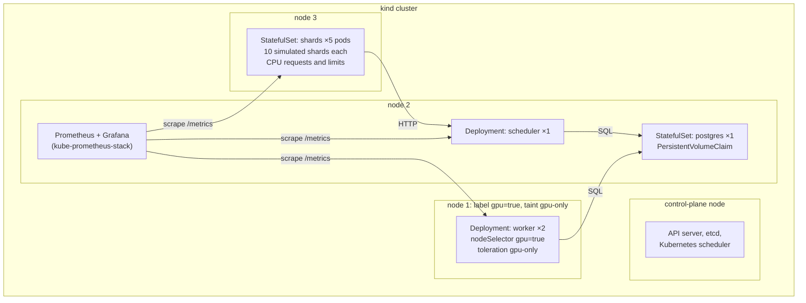
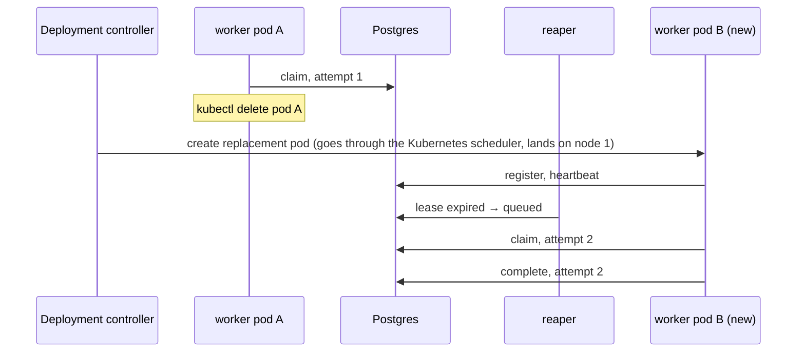
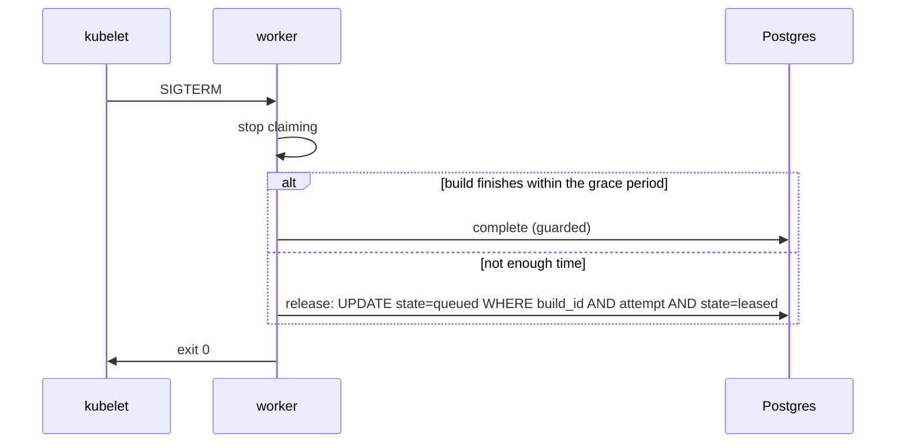

# Phase 2: Kubernetes on kind

## Status and scope

**In progress.** Started 2026-10-08. Steps 1 (the cluster) and 2 (Postgres and the scheduler) done; steps 3 to 6 (workers, shards, metrics, failure injection) to come.

Run the Phase 1 system unchanged on a local kind cluster, with Prometheus and Grafana watching it. The scheduler code and the schema do not change. What changes is who keeps processes alive and where they run.

**Done when** the dashboard shows a worker pod deleted mid-round and the round still completing.

## System diagram

One control-plane node and three worker nodes, all Docker containers on the laptop. One node is labeled and tainted as the stand-in GPU pool.

Nothing except worker pods can land on node 1, because of the taint. Workers can land only on node 1, because of the node selector. This rehearses real GPU scheduling before any GPU exists; in Phase 5 the same manifests add a GPU resource request.

## Flows

### Worker pod deleted mid-build

Two independent recoveries run at once. Kubernetes restores the worker count; the lease path restores the build.

### Graceful shutdown on SIGTERM

Kubernetes sends SIGTERM, waits `terminationGracePeriodSeconds`, then SIGKILL. The worker uses that window instead of making the reaper wait for the lease to expire.

## Design decisions

| # | Decision | Alternatives | Why |
| --- | --- | --- | --- |
| 1 | Workers are a Deployment of long-running pullers | One Kubernetes Job per build | Keeps Phase 1's pull loop unchanged. Per-build Jobs is a different dispatch model; Phase 6 compares the two. |
| 2 | Scheduler runs with one replica, but is written so two are safe | Leader election | The reaper is an idempotent conditional `UPDATE`; two reapers change nothing extra. The API is stateless. Leader election is complexity with nothing to protect. |
| 3 | Postgres as a StatefulSet with a PVC | Managed database outside the cluster | Keeps the everyday environment self-contained on a laptop. A PVC survives pod restarts; the Postgres-restart failure test depends on it. |
| 4 | Shards as a StatefulSet with 10 simulated shards per pod, with CPU requests and limits | One pod per shard; or a Deployment | Stable pod names give stable shard IDs. Limits now mean local builds compete for real CPU in Phase 4 without changing manifests. |
| 5 | Stand-in GPU node via label + taint from the start | Add node constraints only in Phase 5 | The scheduling rehearsal is the point of Phase 2. The Phase 5 change is then one added resource request. |
| 6 | Readiness = can reach Postgres; liveness = process responds | No probes | Readiness keeps a worker that cannot claim from counting as live. Liveness catches a hung worker, which a lease also catches but slower. |
| 7 | Retries with backoff on every Postgres call | Crash and let Kubernetes restart | A Postgres restart would otherwise crash-loop every service. Retrying is cheaper and keeps leases alive across a short outage. |
| 8 | kube-prometheus-stack via Helm, ServiceMonitor per service | Hand-written Prometheus config | The chart is the standard way; the project is not about running Prometheus. |
| 9 | **Cluster shape in one kind config file:** one control-plane node, two general workers, one node labelled `kgpu.io/gpu=true` and tainted `kgpu.io/gpu=true:NoSchedule` at join time through a `kubeadmConfigPatches` block; labels in the config, the taint in the patch | Taint by `kubectl` after creation | Declarative and reproducible: `scripts/kind-up.sh` recreates the same cluster from the file, and the GPU node is never untainted for a moment after boot. The label and taint keys are the ones Phase 5's real GPU pool will carry. |
| 10 | **The step's proof is a scheduling check, not a deployment:** throwaway pods without the toleration must avoid the GPU node, a worker-shaped pod must land on it, and a selector-only pod must stay Pending with the taint cited | Trust the config | `scripts/kind-check-gpu-node.sh` is rerun whenever the cluster is recreated; the Pending case shows the taint doing the repelling, not luck. |
| 11 | **Readiness and liveness are different endpoints.** `/healthz` pings Postgres and is the readiness probe (decision 6: a scheduler that cannot reach the database takes no traffic); `/livez` answers unconditionally and is the liveness probe | One endpoint for both | If liveness depended on Postgres, a database outage would make the kubelet restart a perfectly healthy scheduler every ten seconds. Observed in the step 2 check: Postgres deleted, the scheduler logged reaper errors, stayed up with restart count 0, and recovered on the next tick. |
| 12 | **Manifests are plain YAML under `deploy/k8s/`, applied as one unit with kustomize; images are built locally, tagged `:dev`, loaded into kind with `kind load docker-image`, and pulled `IfNotPresent`** | Helm chart for our own services; a registry | Six files is not a chart. kind nodes cannot see the laptop's images, and `:latest` would make the kubelet try a registry. Phase 5's managed cluster needs a registry; the manifests change only in the image reference. |
| 13 | **Postgres is a one-replica StatefulSet behind a headless Service, with `PGDATA` in a subdirectory of the claimed volume** | A Deployment with a PVC; a managed database | A StatefulSet gives the pod a stable name and a claim that outlives it (the step 2 check deletes the pod and finds the rounds still there). The headless Service makes `postgres` resolve to the pod itself. `PGDATA` must be a subdirectory because the mount point is not empty. |
| 14 | **The scheduler needs no retry wrapper around its Postgres calls beyond reconnecting.** Shards retry their calls (decision 61 in Phase 1), the reaper runs every tick, and pgx's pool re-establishes broken connections | Retry with backoff inside every store call (the roadmap's wording) | During the Postgres outage every scheduler call failed for a few seconds, clients retried, the reaper's next tick succeeded, and nothing was lost; a per-call retry would only have hidden the outage from the logs. The roadmap item is satisfied by the pieces that already exist. |

## Implementation notes

### Step 1: the cluster (done 2026-10-08)

| Path | What |
| --- | --- |
| `deploy/kind/cluster.yaml` | The cluster: control plane, two general workers, one GPU node with label and join-time taint (decision 9). |
| `scripts/kind-up.sh`, `scripts/kind-down.sh` | Create (idempotent) or delete the `kgpu` cluster. |
| `scripts/kind-check-gpu-node.sh` | The scheduling check (decision 10); saves `test-logs/phase2/step1-kind-cluster.log`. |

Toolchain added: kind 0.33, kubectl 1.37, Helm 4.3 (Homebrew).

Observed on the first run: six plain pause pods spread over the two general nodes, none on the GPU node; the worker-shaped pod landed on `kgpu-worker3`; the selector-only pod stayed Pending, the scheduler's event reading "2 node(s) didn't match Pod's node affinity/selector, 2 node(s) had untolerated taint(s)".

### Step 2: Postgres and the scheduler (done 2026-10-08)

| Path | What |
| --- | --- |
| `deploy/k8s/namespace.yaml`, `postgres.yaml`, `scheduler.yaml`, `kustomization.yaml` | The `kgpu` namespace; Postgres as a Secret, a headless Service and a StatefulSet with a 2 GiB volume claim and `pg_isready` probes; the scheduler as a ConfigMap, a Service and a Deployment with `/healthz` readiness and `/livez` liveness (decisions 11 to 13). |
| `scheduler/api` | `GET /livez`. |
| `scripts/k8s-build-load.sh`, `scripts/k8s-up.sh` | Build the three images, load them into kind; apply the manifests and wait for the rollouts. |
| `scripts/k8s-check-step2.sh` | The step's check; saves `test-logs/phase2/step2-postgres-scheduler.log`. |

Observed: the scheduler pod connected, applied all four migrations and listened; the API answered through the Service via a port-forward; deleting the scheduler pod produced a replacement with a new name on which `GET /rounds/1` still returned the round (the data was never in the pod); deleting `postgres-0` brought it back on the same claim with the rounds intact, while the scheduler logged `reap failed` and `finish rounds failed` with a DNS error for the missing pod, kept restart count 0, and served a new round once Postgres was back.

Metric names are fixed in the roadmap (Phase 2, Metrics) and are a contract between phases; do not rename them.

## Notes from the published build-time figures (2026-10-06)

Real builds are minutes on a GPU and hours on a CPU (see the Phase 1 doc, "Cost model v0 against published numbers"). Three consequences for this phase:

- **Probes must not depend on the build thread.** A worker in a 30-minute GPU build must still answer its liveness and readiness probes; the probe endpoint runs on its own thread, like the heartbeat does today, and a probe failure must mean the process is stuck, not that it is busy.
- **`terminationGracePeriodSeconds` stays short and release is the norm.** A build that takes minutes cannot finish inside any sane grace period, so on SIGTERM the worker releases (decision 37's budget stays a few seconds); the grace period only needs to cover the release write. Draining a GPU node therefore costs the in-flight builds' progress, which is the number Phase 5 measures under spot preemption.
- **Shard CPU limits must leave room for a local build's threads.** Hours-long local builds at 2 threads are the modeled case; a limit below that silently changes the cost model. Set requests and limits so the local build gets its modeled threads.

## Open questions

- How long should `terminationGracePeriodSeconds` be relative to the modeled build times? Long enough to finish a typical fake build, short enough that a drain is not slow.
- Does the shard StatefulSet need a headless Service? Only if something addresses an individual shard pod, which nothing does yet.
