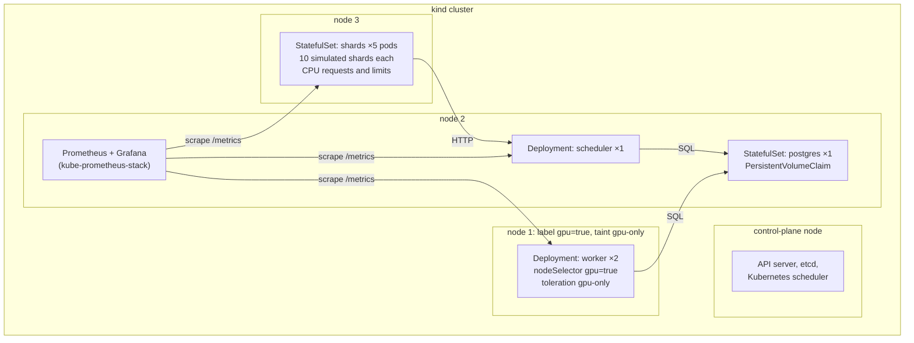
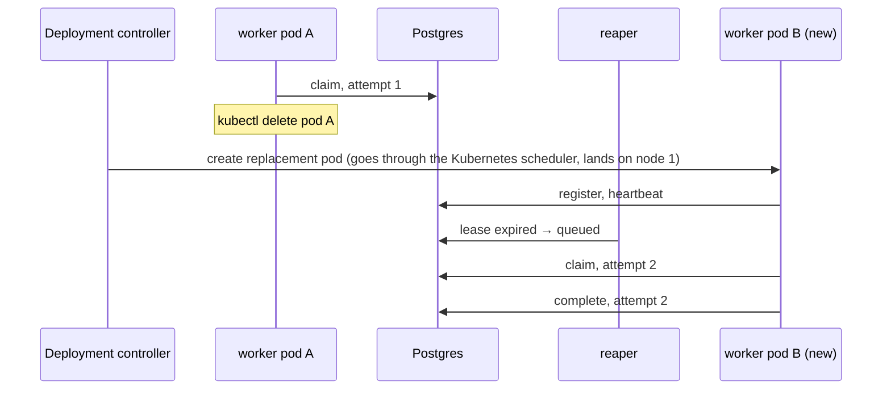
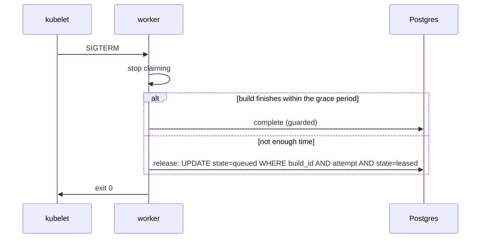

# Phase 2: Kubernetes on kind

## Status and scope

**Planned.** Nothing here is built yet; this doc records the intended design and will be revised as it lands.

Run the Phase 1 system unchanged on a local kind cluster, with Prometheus and Grafana watching it. The scheduler code and the schema do not change. What changes is who keeps processes alive and where they run.

**Done when** the dashboard shows a worker pod deleted mid-round and the round still completing.

## System diagram

One control-plane node and three worker nodes, all Docker containers on the laptop. One node is labeled and tainted as the stand-in GPU pool.

Nothing except worker pods can land on node 1, because of the taint. Workers can land only on node 1, because of the node selector. This rehearses real GPU scheduling before any GPU exists; in Phase 5 the same manifests add a GPU resource request.

## Flows

### Worker pod deleted mid-build

Two independent recoveries run at once. Kubernetes restores the worker count; the lease path restores the build.

### Graceful shutdown on SIGTERM

Kubernetes sends SIGTERM, waits `terminationGracePeriodSeconds`, then SIGKILL. The worker uses that window instead of making the reaper wait for the lease to expire.

## Design decisions

| # | Decision | Alternatives | Why |
| --- | --- | --- | --- |
| 1 | Workers are a Deployment of long-running pullers | One Kubernetes Job per build | Keeps Phase 1's pull loop unchanged. Per-build Jobs is a different dispatch model; Phase 6 compares the two. |
| 2 | Scheduler runs with one replica, but is written so two are safe | Leader election | The reaper is an idempotent conditional `UPDATE`; two reapers change nothing extra. The API is stateless. Leader election is complexity with nothing to protect. |
| 3 | Postgres as a StatefulSet with a PVC | Managed database outside the cluster | Keeps the everyday environment self-contained on a laptop. A PVC survives pod restarts; the Postgres-restart failure test depends on it. |
| 4 | Shards as a StatefulSet with 10 simulated shards per pod, with CPU requests and limits | One pod per shard; or a Deployment | Stable pod names give stable shard IDs. Limits now mean local builds compete for real CPU in Phase 4 without changing manifests. |
| 5 | Stand-in GPU node via label + taint from the start | Add node constraints only in Phase 5 | The scheduling rehearsal is the point of Phase 2. The Phase 5 change is then one added resource request. |
| 6 | Readiness = can reach Postgres; liveness = process responds | No probes | Readiness keeps a worker that cannot claim from counting as live. Liveness catches a hung worker, which a lease also catches but slower. |
| 7 | Retries with backoff on every Postgres call | Crash and let Kubernetes restart | A Postgres restart would otherwise crash-loop every service. Retrying is cheaper and keeps leases alive across a short outage. |
| 8 | kube-prometheus-stack via Helm, ServiceMonitor per service | Hand-written Prometheus config | The chart is the standard way; the project is not about running Prometheus. |

## Implementation notes

_(to be filled in)_

Metric names are fixed in the roadmap (Phase 2, Metrics) and are a contract between phases; do not rename them.

## Open questions

- How long should `terminationGracePeriodSeconds` be relative to the modeled build times? Long enough to finish a typical fake build, short enough that a drain is not slow.
- Does the shard StatefulSet need a headless Service? Only if something addresses an individual shard pod, which nothing does yet.
