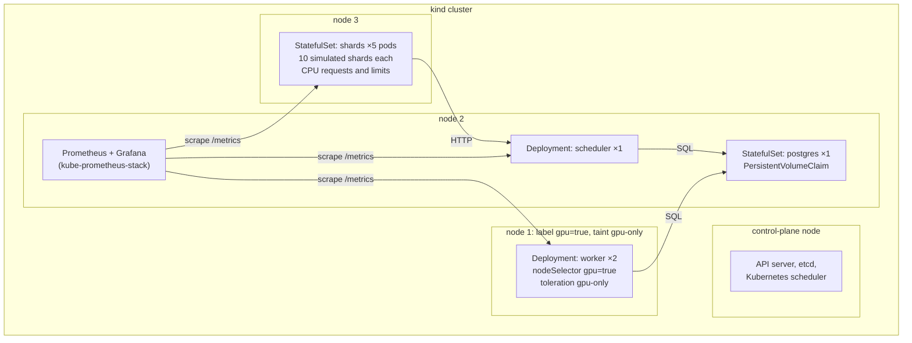
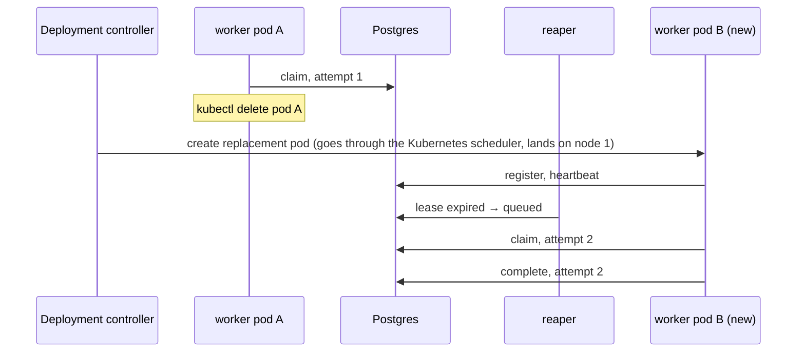
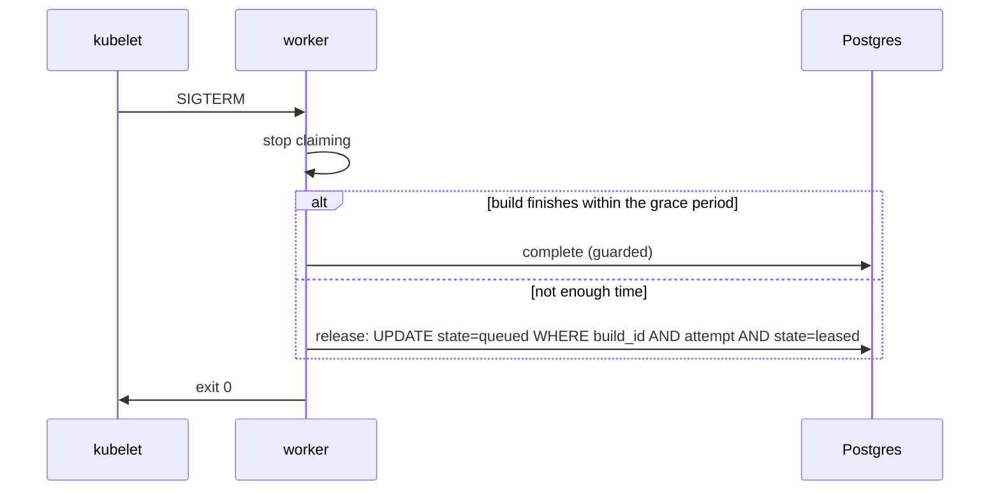

# Phase 2: Kubernetes on kind

## Status and scope

**In progress.** Started 2026-10-08. Steps 1 (the cluster), 2 (Postgres and the scheduler) and 3 (workers) done; steps 4 to 6 (shards, metrics, failure injection) to come.

Run the Phase 1 system unchanged on a local kind cluster, with Prometheus and Grafana watching it. The scheduler code and the schema do not change. What changes is who keeps processes alive and where they run.

**Done when** the dashboard shows a worker pod deleted mid-round and the round still completing.

## System diagram

One control-plane node and three worker nodes, all Docker containers on the laptop. One node is labeled and tainted as the stand-in GPU pool.

The taint keeps every pod *without the toleration* off node 1; the node selector keeps the workers *on* it. Precisely: the toleration grants access and the selector constrains, so any manifest that copies the toleration can land on the GPU node, and on an otherwise idle node the Kubernetes scheduler will even prefer it (the cross-check saw six toleration-only pods all placed there). "Only workers on the GPU node" is therefore a convention kept by not copying the toleration, not something Kubernetes enforces; an admission policy could enforce it later if it ever matters. This rehearses real GPU scheduling before any GPU exists; in Phase 5 the same manifests add a GPU resource request, which on kind stays Pending with "Insufficient nvidia.com/gpu" because there is no device plugin.

## Flows

### Worker pod deleted mid-build

Two independent recoveries run at once. Kubernetes restores the worker count; the lease path restores the build.

### Graceful shutdown on SIGTERM

Kubernetes sends SIGTERM, waits `terminationGracePeriodSeconds`, then SIGKILL. The worker uses that window instead of making the reaper wait for the lease to expire.

## Design decisions

| # | Decision | Alternatives | Why |
| --- | --- | --- | --- |
| 1 | Workers are a Deployment of long-running pullers | One Kubernetes Job per build | Keeps Phase 1's pull loop unchanged. Per-build Jobs is a different dispatch model; Phase 6 compares the two. |
| 2 | Scheduler runs with one replica, but is written so two are safe | Leader election | The reaper is an idempotent conditional `UPDATE`; two reapers change nothing extra. The API is stateless. Leader election is complexity with nothing to protect. |
| 3 | Postgres as a StatefulSet with a PVC | Managed database outside the cluster | Keeps the everyday environment self-contained on a laptop. A PVC survives pod restarts; the Postgres-restart failure test depends on it. |
| 4 | Shards as a StatefulSet with 10 simulated shards per pod, with CPU requests and limits | One pod per shard; or a Deployment | Stable pod names give stable shard IDs. Limits now mean local builds compete for real CPU in Phase 4 without changing manifests. |
| 5 | Stand-in GPU node via label + taint from the start | Add node constraints only in Phase 5 | The scheduling rehearsal is the point of Phase 2. The Phase 5 change is then one added resource request. |
| 6 | Readiness = can reach Postgres; liveness = process responds | No probes | Readiness keeps a worker that cannot claim from counting as live. Liveness catches a hung worker, which a lease also catches but slower. |
| 7 | Retries with backoff on every Postgres call | Crash and let Kubernetes restart | A Postgres restart would otherwise crash-loop every service. Retrying is cheaper and keeps leases alive across a short outage. |
| 8 | kube-prometheus-stack via Helm, ServiceMonitor per service | Hand-written Prometheus config | The chart is the standard way; the project is not about running Prometheus. |
| 9 | **Cluster shape in one kind config file:** one control-plane node, two general workers, one node labelled `kgpu.io/gpu=true` and tainted `kgpu.io/gpu=true:NoSchedule` at join time through a `kubeadmConfigPatches` block; labels in the config, the taint in the patch | Taint by `kubectl` after creation | Declarative and reproducible: `scripts/kind-up.sh` recreates the same cluster from the file, and the GPU node is never untainted for a moment after boot. The label and taint keys are the ones Phase 5's real GPU pool will carry. |
| 10 | **The step's proof is a scheduling check, not a deployment:** throwaway pods without the toleration must avoid the GPU node, a worker-shaped pod must land on it, and a selector-only pod must stay Pending with the taint cited | Trust the config | `scripts/kind-check-gpu-node.sh` is rerun whenever the cluster is recreated; the Pending case shows the taint doing the repelling, not luck. |
| 11 | **Readiness and liveness are different endpoints.** `/healthz` pings Postgres and is the readiness probe (decision 6: a scheduler that cannot reach the database takes no traffic); `/livez` answers unconditionally and is the liveness probe | One endpoint for both | If liveness depended on Postgres, a database outage would make the kubelet restart a perfectly healthy scheduler every ten seconds. Observed in the step 2 check: Postgres deleted, the scheduler logged reaper errors, stayed up with restart count 0, and recovered on the next tick. |
| 12 | **Manifests are plain YAML under `deploy/k8s/`, applied as one unit with kustomize; images are built locally, tagged `:dev`, loaded into kind with `kind load docker-image`, and pulled `IfNotPresent`** | Helm chart for our own services; a registry | Six files is not a chart. kind nodes cannot see the laptop's images, and `:latest` would make the kubelet try a registry. Phase 5's managed cluster needs a registry; the manifests change only in the image reference. |
| 13 | **Postgres is a one-replica StatefulSet behind a headless Service, with `PGDATA` in a subdirectory of the claimed volume** | A Deployment with a PVC; a managed database | A StatefulSet gives the pod a stable name and a claim that outlives it (the step 2 check deletes the pod and finds the rounds still there). The headless Service makes `postgres` resolve to the pod itself. `PGDATA` must be a subdirectory because the mount point is not empty. |
| 14 | **The scheduler needs no retry wrapper around its Postgres calls beyond reconnecting.** Shards retry their calls (decision 61 in Phase 1), the reaper runs every tick, and pgx's pool re-establishes broken connections | Retry with backoff inside every store call (the roadmap's wording) | During the Postgres outage every scheduler call failed for a few seconds, clients retried, the reaper's next tick succeeded, and nothing was lost; a per-call retry would only have hidden the outage from the logs. The roadmap item is satisfied by the pieces that already exist. |
| 15 | **Migrations report what they did:** the scheduler logs `migrations checked` with the files applied by this process, how many were already there, and how long the advisory lock took | Silent migrations | With two replicas starting together the logs could not show which one applied the schema or that the other waited on the lock; the cross-check had to read `pg_locks` to see it. (Cross-check gap.) |
| 16 | **The worker serves its probes from a thread of its own:** `/livez` always 200, `/healthz` 200 only if a heartbeat to Postgres succeeded within three heartbeat intervals | Reuse the main loop; probe via `exec` | A worker thirty minutes into a build must still answer liveness, and readiness must track Postgres, not the build. Verified mid-build in the step 3 check. |
| 17 | **`WORKER_ID` is the pod name, from the downward API** | The hostname (what Compose used) | On Kubernetes the hostname is the pod name anyway, but saying so explicitly gives a readable, unique id per replica, and a replaced pod gets a new one. |
| 18 | **The worker image carries its own init (tini at PID 1)** | Rely on the platform's init flag | Compose had `init: true`; Kubernetes has no such flag. Without an init, python is PID 1 and an in-container SIGKILL is dropped by the kernel: the first version of the step 3 crash test killed nothing. tini also forwards SIGTERM and reaps zombies. |
| 19 | **The crash test on Kubernetes is an in-container kill of the worker process, not a forced pod deletion.** `kubectl delete pod --grace-period=0 --force` still delivers SIGTERM before the kill, so the worker's release path runs and no lease expires; it is a graceful stop in disguise. The in-container kill exits the container with 137, the lease expires, the reaper requeues, and the kubelet restarts the container in place | Treat forced deletion as the crash | Measured: forced deletion gave attempt 2 in 8 s with zero lease expiries; the in-container kill gave attempt 2 in 17 s (10 s lease plus the 6.5 s build) with one expiry and restart count 1. The script keeps the forced deletion as a documented observation. |
| 20 | **The worker's liveness probe carries its own `terminationGracePeriodSeconds: 5`** | Inherit the pod's 30 s | A process the liveness probe has declared hung cannot act on SIGTERM; waiting the pod's full grace period before SIGKILL meant a frozen worker took 52 s to restart (cross-check). The lease path was unaffected (reaped at 10 s); this only shortens how long a dead container occupies the slot. |
| 21 | **`GET /workers` lists every registered worker with a `live` flag; `pool` counts only the live ones** | List only live workers | An operator wants to see who went quiet; the policy wants the live count. Both from one call. (Cross-check gap.) |

## Implementation notes

### Step 1: the cluster (done 2026-10-08)

| Path | What |
| --- | --- |
| `deploy/kind/cluster.yaml` | The cluster: control plane, two general workers, one GPU node with label and join-time taint (decision 9). |
| `scripts/kind-up.sh`, `scripts/kind-down.sh` | Create (idempotent) or delete the `kgpu` cluster. |
| `scripts/kind-check-gpu-node.sh` | The scheduling check (decision 10); saves `test-logs/phase2/step1-kind-cluster.log`. |

Toolchain added: kind 0.33, kubectl 1.37, Helm 4.3 (Homebrew).

Observed on the first run: six plain pause pods spread over the two general nodes, none on the GPU node; the worker-shaped pod landed on `kgpu-worker3`; the selector-only pod stayed Pending, the scheduler's event reading "2 node(s) didn't match Pod's node affinity/selector, 2 node(s) had untolerated taint(s)".

### Step 2: Postgres and the scheduler (done 2026-10-08)

| Path | What |
| --- | --- |
| `deploy/k8s/namespace.yaml`, `postgres.yaml`, `scheduler.yaml`, `kustomization.yaml` | The `kgpu` namespace; Postgres as a Secret, a headless Service and a StatefulSet with a 2 GiB volume claim and `pg_isready` probes; the scheduler as a ConfigMap, a Service and a Deployment with `/healthz` readiness and `/livez` liveness (decisions 11 to 13). |
| `scheduler/api` | `GET /livez`. |
| `scripts/k8s-build-load.sh`, `scripts/k8s-up.sh` | Build the three images, load them into kind; apply the manifests and wait for the rollouts. |
| `scripts/k8s-check-step2.sh` | The step's check; saves `test-logs/phase2/step2-postgres-scheduler.log`. |

### Cross-check of steps 1 and 2 (2026-10-08)

A fresh agent deployed its own copy of the stack into a `kgpu-xcheck` namespace, with the scheduler at two replicas, and tested through `kubectl` and the API. 9 tests, all passed. Beyond the implementer's scripts: two replicas started together on an empty database four times, applying exactly four migrations each time with no restarts; with the test holding advisory lock `0x4B475055` for 25 s, `pg_locks` showed both replicas waiting, no table was created, and neither became ready until the release; a Postgres outage held 45 s, past the liveness budget, during which `/healthz` returned 503 on 41 of 41 samples, `/livez` 200 on every one, the pod left the Service's endpoints at 8 s and the restart count stayed 0; the whole StatefulSet deleted and re-applied reattached the same claim with the rounds intact; a SIGKILL of the scheduler process from the node (the image has no shell) was restarted in place by the kubelet (exit 137, restart count 1, ready in 1.7 s); DNS for the headless and normal Services resolved as designed; a `nvidia.com/gpu` request stayed Pending as the Phase 5 difference.

| Finding | Resolution |
| --- | --- |
| A toleration alone lands a pod on the GPU node, and the scheduler prefers that node when it is idle; "only workers there" is a convention. | Stated in the system diagram text above. |
| Migrations are invisible in the logs. | Decision 15: `migrations checked` log line with the files applied, the count already present, and the lock wait. |
| NotReady arrives about 8 s after the database vanishes, from the unstated default `failureThreshold`. | Made explicit in the manifest with a comment. |
| Two replicas are untested under the reaper (needs workers). | Step 3. |
| Deleting the whole StatefulSet was not in the step 2 check. | The agent's test covers it; recorded here. |

Observed in the step 2 check: the scheduler pod connected, applied all four migrations and listened; the API answered through the Service via a port-forward; deleting the scheduler pod produced a replacement with a new name on which `GET /rounds/1` still returned the round (the data was never in the pod); deleting `postgres-0` brought it back on the same claim with the rounds intact, while the scheduler logged `reap failed` and `finish rounds failed` with a DNS error for the missing pod, kept restart count 0, and served a new round once Postgres was back.

Metric names are fixed in the roadmap (Phase 2, Metrics) and are a contract between phases; do not rename them.

## Notes from the published build-time figures (2026-10-06)

Real builds are minutes on a GPU and hours on a CPU (see the Phase 1 doc, "Cost model v0 against published numbers"). Three consequences for this phase:

- **Probes must not depend on the build thread.** A worker in a 30-minute GPU build must still answer its liveness and readiness probes; the probe endpoint runs on its own thread, like the heartbeat does today, and a probe failure must mean the process is stuck, not that it is busy.
- **`terminationGracePeriodSeconds` stays short and release is the norm.** A build that takes minutes cannot finish inside any sane grace period, so on SIGTERM the worker releases (decision 37's budget stays a few seconds); the grace period only needs to cover the release write. Draining a GPU node therefore costs the in-flight builds' progress, which is the number Phase 5 measures under spot preemption.
- **Shard CPU limits must leave room for a local build's threads.** Hours-long local builds at 2 threads are the modeled case; a limit below that silently changes the cost model. Set requests and limits so the local build gets its modeled threads.

### Step 3: the workers (done 2026-10-08)

| Path | What |
| --- | --- |
| `worker/kgpu_worker/health.py` | The probe server thread (decision 16); `HEALTH_ADDR`, default `:8081`. |
| `worker/Dockerfile` | tini as PID 1 (decision 18). |
| `deploy/k8s/worker.yaml` | ConfigMap with test-friendly values (10 s lease, 10x fake builds), a Deployment of two replicas with the GPU node selector and toleration, `WORKER_ID` from the pod name, probes on 8081, a 30 s termination grace period. |
| `scripts/k8s-check-step3.sh` | The step's check; saves `test-logs/phase2/step3-workers.log`. |

Observed: both workers on `kgpu-worker3`, registered under their pod names; a 2M-vector build done at attempt 1 with both probes answering 200 mid-build; a graceful deletion mid-build released the build within a second and the replacement landed on the GPU node, the build finishing at attempt 2 once; an in-container kill expired the lease and the build finished at attempt 2 once, 17 s later, with the container restarted in place; a forced deletion ran the release path (decision 19).

### Cross-check of step 3, the workers (2026-10-08)

A fresh agent deployed its own stack into `kgpu-xcheck` and ran 9 subtests, all passed, saved as `test-logs/phase2/step3-crosscheck-kind-workers.log`. Beyond the implementer's check: three replicas leased three builds at once and a scale-down released the long one and deregistered within a second; with two scheduler replicas, two leaseholders SIGKILLed at the same moment produced exactly one reap line per build across both schedulers and one completion each; a 40 s Postgres outage mid-build gave readiness 503 from about 8 s with liveness 200 on 38 of 38 samples, no restarts, the attempt lost to the lease deadline and recovered once Postgres returned (Phase 1 decision 48 on Kubernetes); a SIGSTOP'd worker was caught by liveness while the reaper recovered its lease at 10 s; SIGTERM with 3 s left finished the build and with 7 s left released it; draining the GPU node evicted both workers through the release path, left five builds queued with replacements Pending on the taint, and uncordoning drained the queue with every build completed once.

The agent disclosed that one exploratory `kubectl apply` landed on the `kgpu` namespace with an unmodified render because macOS `sed` silently ignored a `\s` pattern; the objects were unchanged except an annotation, no pod restarted, and the rewrite was redone with perl and verified.

| Finding | Resolution |
| --- | --- |
| A hung worker took 52 s to restart: liveness fired at 30 s, then SIGTERM to a stopped process waited the pod's 30 s grace. | Decision 20: a 5 s grace on the liveness probe. |
| `/workers` listed a frozen worker while the pool counted one. | Decision 21: a `live` flag per worker. |
| Two reapers were never seen contending: the same replica logged every reap and an idle tick logs nothing. | Per-replica `lease_expirations_total` in step 5 makes it visible. |
| The readiness threshold is "within three heartbeat intervals" measured from the last *successful* heartbeat; the probe period adds up to one interval, so the first 503 lands 2 to 3 intervals after the last success. | Stated here. |
| A Postgres outage longer than the lease always costs the in-flight attempt (decision 48 working as designed). | Noted beside the roadmap's "Restart Postgres" item. |
| The drain checklist item is answered for workers; the dashboard view is pending. | Roadmap ticked with the note. |

## Open questions

- How long should `terminationGracePeriodSeconds` be relative to the modeled build times? Long enough to finish a typical fake build, short enough that a drain is not slow.
- Does the shard StatefulSet need a headless Service? Only if something addresses an individual shard pod, which nothing does yet.
