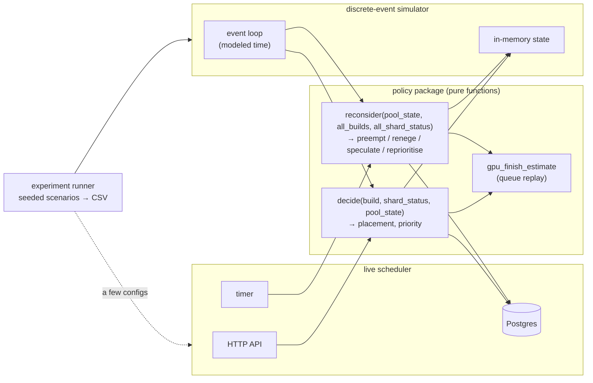
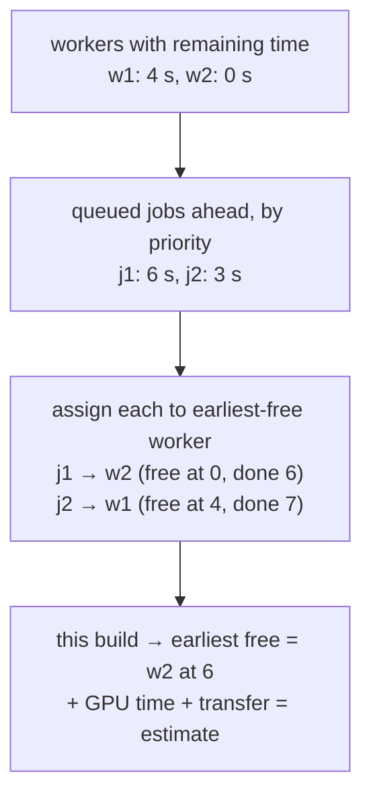
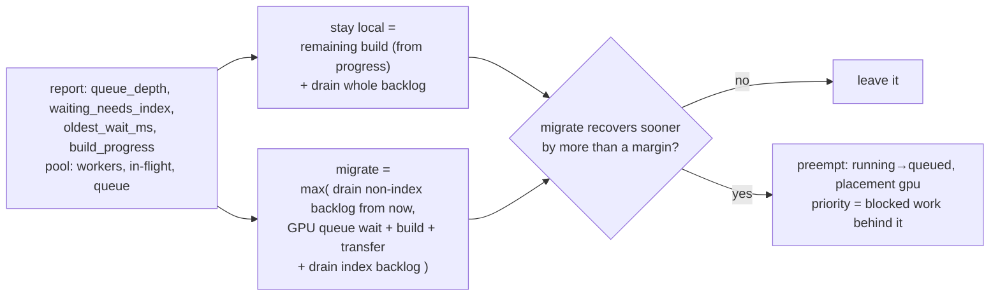
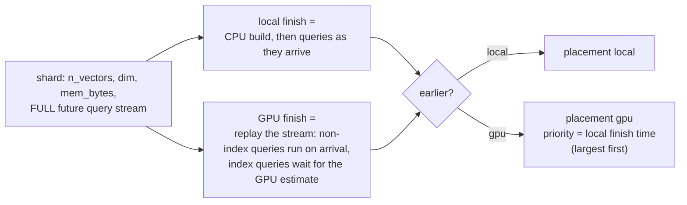
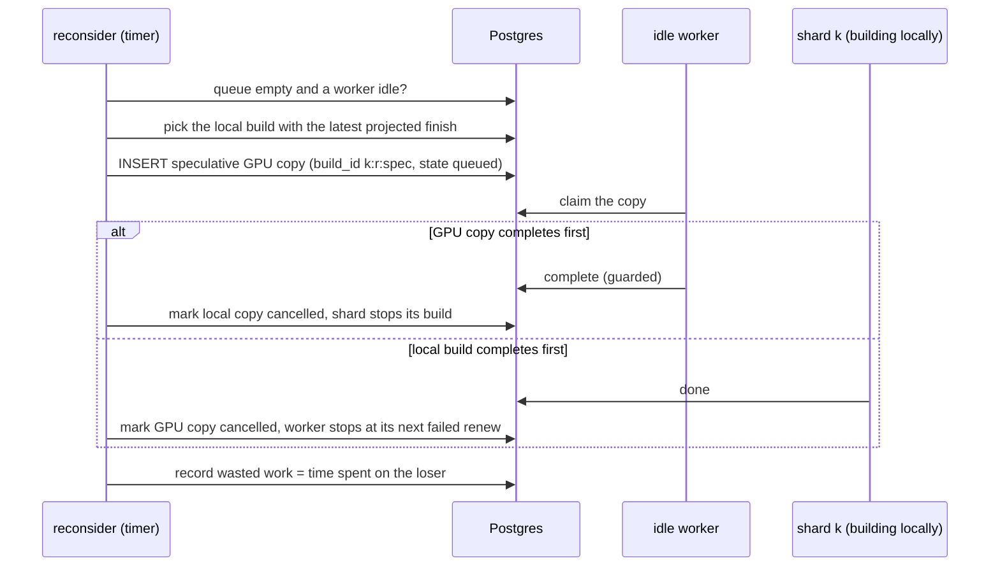

# Phase 3: placement policies and experiments

## Status and scope

**Planned.** This is the core of the project: five policies behind one interface, compared on identical seeded workloads across the six scenarios. Builds are still fake.

The centerpiece is **reactive migration**: a deployable policy that knows only what a real shard reports, and moves a local build to the GPU when the shard's growing query backlog says it should. The **clairvoyant** cost-based policy, which knows every shard's future queries, is kept as an oracle to measure what the unknowable future costs. (Model revision of 2026-10-02; see Phase 1 decisions 28 to 32.)

**Done when** the policy comparison exists for every scenario plus the sweeps in the roadmap, with the simulator validated against a few live runs.

## System diagram

The policy package is pure and is linked into two hosts: the live scheduler and a discrete-event simulator. Both feed it the same inputs; only the clock differs.

## Flows

### Queue replay: the GPU finish estimate

List scheduling over the current queue. Possible only because the scheduler sees every queued job and every live worker.

### Reactive migration: the reconsider step for one locally building shard

Inputs are the shard's latest report and the pool. Nothing about the future.

The backlog is estimated from the report alone: `queue_depth` queries with the scenario's mean duration, split by `waiting_needs_index`. The arrival rate is estimated from successive reports. The margin guards against flapping, and `build_progress` carries the sunk cost: a build at ninety percent has little remaining time to save.

### Clairvoyant cost-based decision (oracle, simulator only)

Priority equals the shard's would-be local finish time, so the worst would-be straggler gets a GPU first (longest-processing-time-first). This is the design the project started with; it is kept because it bounds what any deployable policy can achieve.

### Speculation

## Design decisions

| # | Decision | Alternatives | Why |
| --- | --- | --- | --- |
| 1 | Policies are pure functions of passed-in state; no I/O, no clock, seeded randomness only | Policies query Postgres directly | The simulator can then reuse them byte for byte, and the sweep comparison measures the policy, not two implementations of it. |
| 1a | Deployable policies see only `shard_status` reports; the future query stream is passed only to the clairvoyant oracle, and only in the simulator | One cost-based policy that knows the jobs (the original design) | A real shard cannot declare its future. Separating "what a scheduler can know" from "what the simulator knows" makes the gap measurable. |
| 1b | Preemption of a local build is a first-class `reconsider` action, with the sunk cost read from the shard's reported `build_progress` | Speculation only (never kill a local build) | Freeing the CPU is the only way to help queries that don't need the index while the build is still running. Speculation stays as the alternative for backlogs dominated by `needs_index` queries. |
| 2 | Priority is a number computed by the policy and stored on the row; the claim query orders by it | Separate queues per priority class | One queue, one index, one claim statement. The policy owns the meaning of the number. |
| 3 | `reconsider` runs on a timer in the scheduler and expresses every action as a row change | A long-lived planner that holds the queue in memory | Keeps invariant 1 (all state in Postgres) and makes reconsider restart-safe. |
| 4 | Reneging moves a queued GPU job back to local by a guarded `UPDATE … WHERE state = 'queued'` | Cancel and resubmit | A leased job is never reneged; only queued ones. The guard makes it race-free against a concurrent claim. |
| 5 | A speculative copy is a second `builds` row with its own `build_id` suffix | A flag on the original row | Two rows, two leases, two attempt counters. The original invariants hold unchanged. |
| 6 | Simulator for sweeps, live cluster for validation only | Sweeps on the live cluster | Fake jobs sleep in real time; a 200-round sweep would take days. Disagreement between the two is itself a result to write up. |
| 7 | Estimate error injected as log-normal noise on every estimate the policy sees | Only on build times | The policy never sees truth; the sweep over σ measures its fragility end to end. |

## Open questions

- Should `reconsider` be able to pre-empt a leased job (cancel it mid-build to hand the GPU to a worse straggler)? Not in Phase 3. It adds wasted work and the speculation policy already covers the idle-GPU case.
- Where does the shard's local build estimate come from? In Phase 3 it is the same cost model the scheduler uses, corrected by reported `build_progress`. In Phase 4 the shard measures.
- How is the arrival rate estimated from reports? First version: difference in cumulative arrivals between reports over the report interval, smoothed. The report may need a cumulative `arrived` count for this.
- Flapping: a build preempted to the GPU queue and then reneged back to local has lost its progress twice. The margin and a "moved at most once" rule are candidates.
