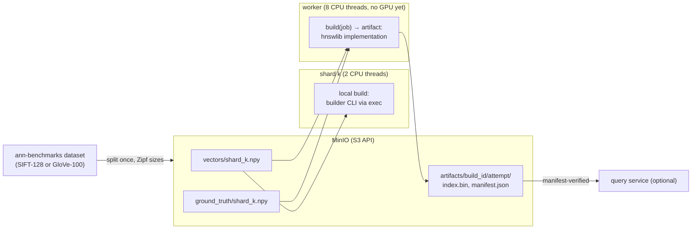
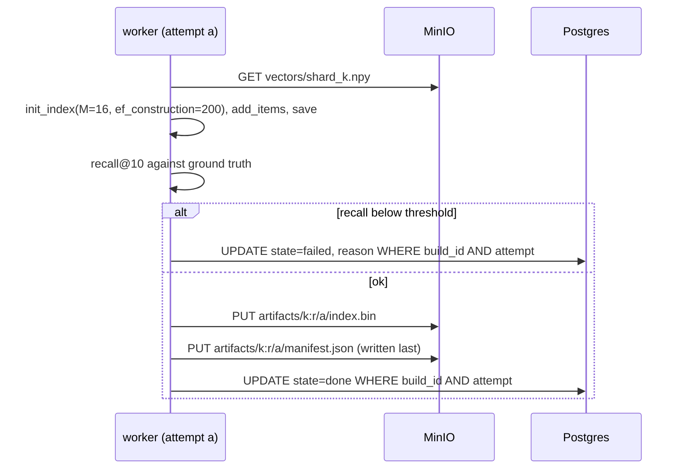
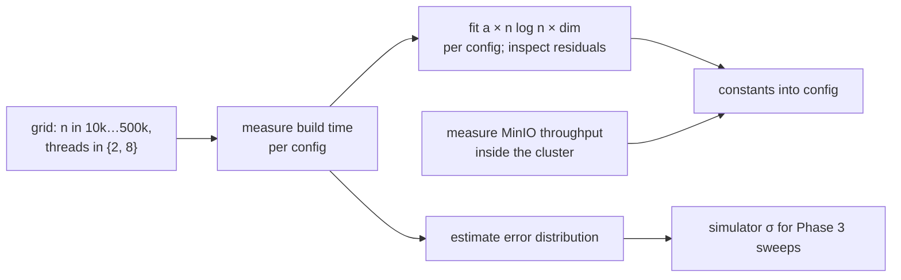

# Phase 4: real CPU builds with hnswlib

## Status and scope

**Planned.** Replace sleeps with real hnswlib builds on real vectors, add the object store, and replace the cost model's constants with measurements.

**Done when** the fitted cost model's error distribution is known and the Phase 3 comparison has been rerun on real builds.

## System diagram

MinIO joins as the second stateful service. Vectors flow out to workers; index files and manifests flow back. The scheduler and Postgres are unchanged; only the build implementation and the shard's local build change.

Workers get more threads than a shard, so the tradeoff keeps its shape without a GPU: remote builds are faster but wait in a queue and pay transfer.

## Flows

### Publish order and fencing on the artifact store

A stale attempt writes under its own `attempt` prefix and can never overwrite the winner. A reader that sees a manifest knows the index beside it is complete. Completion in Postgres is recorded only after the manifest exists, so `state = done` implies a readable artifact.

### Calibration

## Design decisions

| # | Decision | Alternatives | Why |
| --- | --- | --- | --- |
| 1 | Object store (MinIO) for vectors and artifacts | Blobs in Postgres; shared filesystem | Hundreds of MB per shard. Postgres is a poor file server; a shared filesystem is painful across machines. S3 API means the cloud phase changes a URL. |
| 2 | Artifacts under `build_id/attempt/`, manifest written last, completion recorded after | Overwrite a single path per build | The fencing token extends to the artifact store. Without it a paused worker could overwrite a newer index after waking. |
| 3 | The builder is a CLI invoked by both the Python worker and the Go shard (via exec) | Reimplement the build in Go for the shard | One implementation, one set of parameters, one recall gate. Shard-side build cost is measured on the same code. |
| 4 | Recall gate before publishing | Trust the build | Catches a broken build before it is marked done. Also the secondary metric from the roadmap. |
| 5 | Follow-up jobs become CPU-burning loops, not sleeps | Keep sleeping | They must compete with local builds for the shard's real CPU limit, or the blocking rule is not being tested. |
| 6 | Fit the cost model from measurements and keep the residuals | Assume n log n | The estimate error distribution is an input to Phase 3's σ sweep; assuming the curve would hide the project's main uncertainty. |

## Open questions

- Dataset: SIFT-128 (1M) or GloVe-100? Decide by what fits in laptop memory after the Zipf split with 50 shards.
- Is the optional query service worth building? Only if there is time; it is the thing that would make "swap in a new index without dropping requests" concrete.
