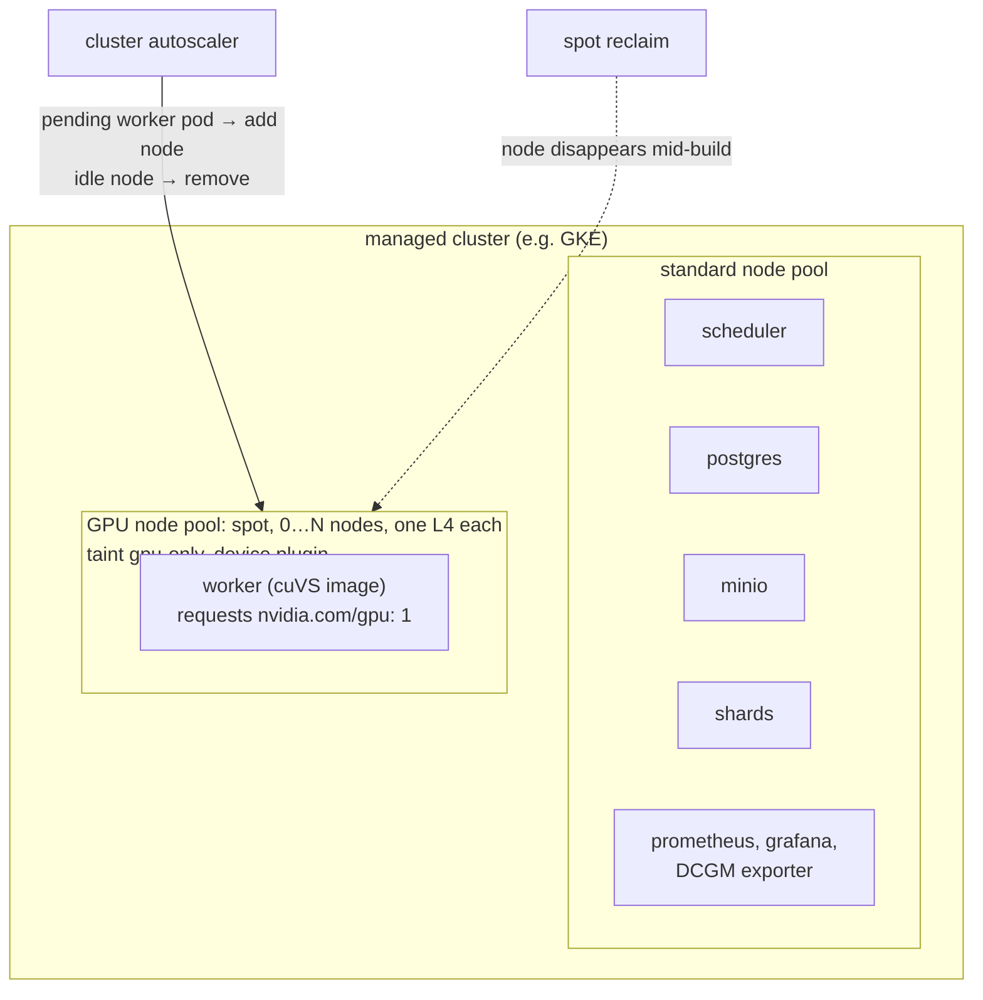
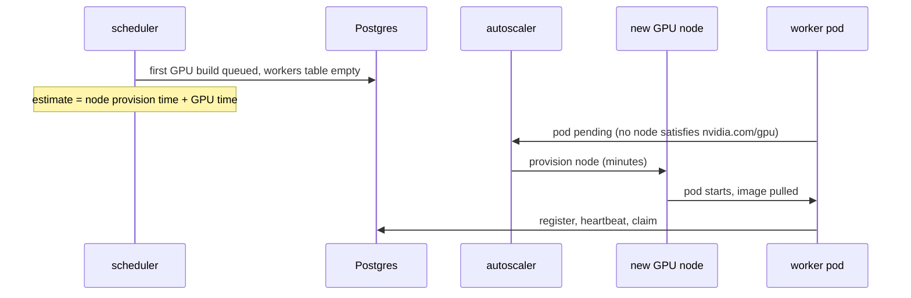
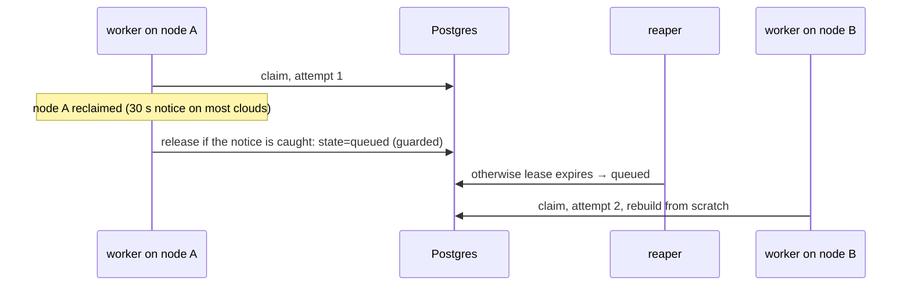

# Phase 5: GPUs and cuVS

## Status and scope

**Planned.** Add a real GPU build implementation, run it for a few hours on a small cloud GPU node pool, and rerun the comparison with a measured GPU cost model.

**Done when** the policy comparison includes real GPU numbers and a spot preemption has been observed and recovered from.

## System diagram

The same manifests as Phase 2, applied to a managed cluster with a GPU node pool that autoscales from zero. The worker image changes; nothing else does.

## Flows

### Cold start

With the pool at zero, the first GPU job waits for a node. That delay is part of the GPU finish estimate, so the cost-based policy sends more work to CPUs while the pool is cold.

### Spot preemption

Recovery goes through the lease path; Kubernetes replaces the pod when a node is available again. What is measured: work lost per preemption, and whether a shorter renew interval would reduce it.

## Design decisions

| # | Decision | Alternatives | Why |
| --- | --- | --- | --- |
| 1 | Separate GPU worker image on a RAPIDS/cuVS base; CPU image unchanged | One image with both | The GPU image is large and needs CUDA. Keeping the CPU image lets the kind cluster stay the everyday environment. |
| 2 | Build CAGRA with cuVS, convert to HNSW, save; verify it loads in hnswlib | Serve CAGRA directly | The query path stays CPU hnswlib, matching the industry pattern (build on GPU, search on CPU). |
| 3 | Memory constraint in placement uses measured peak GPU memory per size | The modeled `mem_bytes` from Phase 1 | Phase 1's model is a placeholder; this phase measures it. |
| 4 | Spot nodes, autoscaling from zero, billing alert first, tear down after each session | On-demand nodes kept up | Cost. Preemption is also a feature here: it is the failure this phase wants to observe. |
| 5 | Cold-start delay added to the GPU finish estimate | Ignore it | It is real, minutes long, and the cost-based policy should visibly prefer CPUs while the pool is cold. |

## Open questions

- Faiss with cuVS-backed CAGRA as the fallback build path if the direct cuVS API causes trouble.
- Which cloud. GKE is the roadmap's example because its GPU node pools and autoscaler are well documented.
