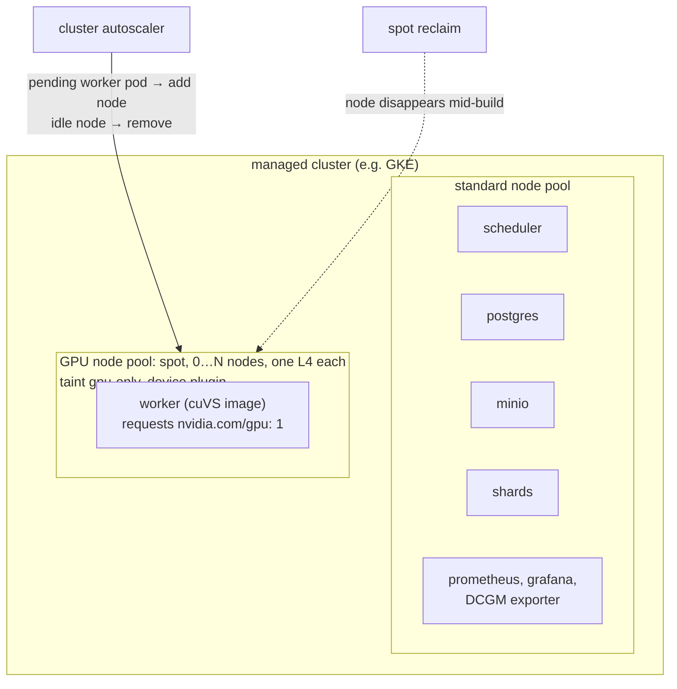
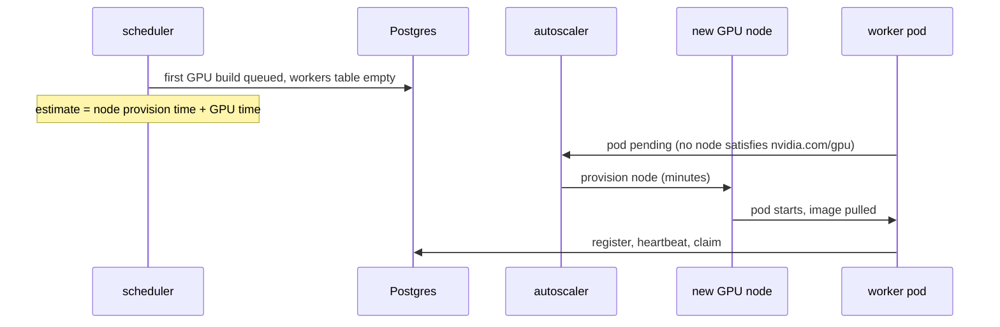
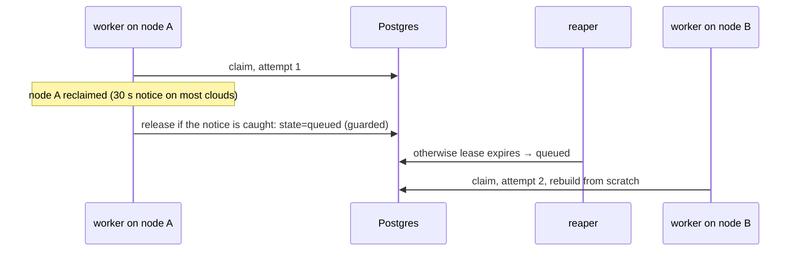

# Phase 5: GPUs and cuVS

## Status and scope

**Planned.** Add a real GPU build implementation, run it for a few hours on a small cloud GPU node pool, and rerun the comparison with a measured GPU cost model.

**Done when** the policy comparison includes real GPU numbers and a spot preemption has been observed and recovered from.

## System diagram

The same manifests as Phase 2, applied to a managed cluster with a GPU node pool that autoscales from zero. The worker image changes; nothing else does.

## Flows

### Cold start

With the pool at zero, the first GPU job waits for a node. That delay is part of the GPU finish estimate, so the cost-based policy sends more work to CPUs while the pool is cold.

### Spot preemption

Recovery goes through the lease path; Kubernetes replaces the pod when a node is available again. What is measured: work lost per preemption, and whether a shorter renew interval would reduce it.

## Design decisions

| # | Decision | Alternatives | Why |
| --- | --- | --- | --- |
| 1 | Separate GPU worker image on a RAPIDS/cuVS base; CPU image unchanged | One image with both | The GPU image is large and needs CUDA. Keeping the CPU image lets the kind cluster stay the everyday environment. |
| 2 | Build CAGRA with cuVS, convert to HNSW, save; verify it loads in hnswlib | Serve CAGRA directly | The query path stays CPU hnswlib, matching the industry pattern (build on GPU, search on CPU). |
| 3 | Memory constraint in placement uses measured peak GPU memory per size | The modeled `mem_bytes` from Phase 1 | Phase 1's model is a placeholder; this phase measures it. |
| 4 | Spot nodes, autoscaling from zero, billing alert first, tear down after each session | On-demand nodes kept up | Cost. Preemption is also a feature here: it is the failure this phase wants to observe. |
| 5 | Cold-start delay added to the GPU finish estimate | Ignore it | It is real, minutes long, and the cost-based policy should visibly prefer CPUs while the pool is cold. |

## What the published figures change here (2026-10-06)

- **GPU memory sizing is a hard constraint.** An L4 has 24 GB; the OpenSearch RFC built 5M x 1536 on a 24 GB A10G, and 10M at that width does not fit. The placement memory constraint added in this phase must use measured peak memory per size and dimension, and the node pool choice (L4 24 GB vs A100/H100 40 to 80 GB) decides which shards can be offloaded at all.
- **Cold start is comparable to the build.** A GPU build of 1 to 10M vectors is 17 s to 4 minutes (RFC); node provisioning is minutes. The cold-start term in the estimate is therefore of the same order as the work, which is why the cost-based policy should visibly prefer CPUs while the pool is cold.
- **A spot preemption costs up to a whole build**, minutes of GPU work, not the seconds the fake builds suggested. Record lost GPU-minutes per preemption; whether checkpointing partial graphs is worth it becomes a real question (noted below).
- **Transfer inside the cluster matters.** 6 to 61 GB per shard means the worker's network path to the object store is part of the GPU cost; place workers and MinIO in the same zone and measure the bandwidth the worker actually gets.
- **Expected GPU numbers to compare against:** 1M x 128 in 17 s and 10M x 128 in 227 s on an A10G; 50M in under 30 minutes on an H100.

## Open questions

- Is checkpointing a partially built CAGRA graph feasible, so a spot preemption loses minutes rather than a whole build? Only worth asking if measured preemption loss is large.

- Faiss with cuVS-backed CAGRA as the fallback build path if the direct cuVS API causes trouble.
- Which cloud. GKE is the roadmap's example because its GPU node pools and autoscaler are well documented.
