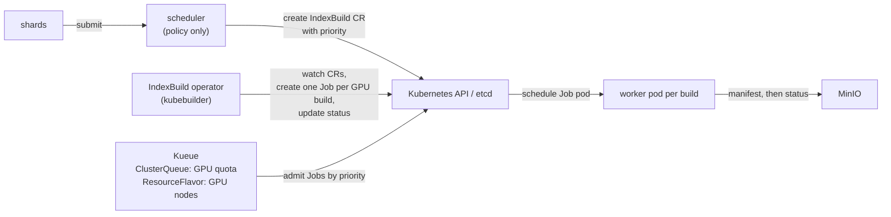

# Phase 6 (optional): Kubernetes-native dispatch

## Status and scope

**Optional, planned.** Rebuild the dispatch side with a custom resource, an operator and Kueue, then write down what each hand-built piece became. The placement policy stays on top: Kueue does admission, quota and priority, but it cannot make the CPU-versus-GPU decision because it knows nothing about the shard's follow-up work.

## System diagram

## What each hand-built piece became

| Hand-built (Phases 1–5) | Kubernetes-native | Note |
| --- | --- | --- |
| `builds` table in Postgres | `IndexBuild` custom resources in etcd | Visible through kubectl; controllers watch instead of polling |
| Claim with `SKIP LOCKED` | Kueue admits a Job, the Kubernetes scheduler binds its pod | Push instead of pull |
| Lease expiry and the reaper | Job retries (`backoffLimit`) and node lifecycle handling | Same idea, different trigger |
| Reaper loop | Controller reconcile loop | Same pattern |
| Queue priority | Kueue workload priority | The policy still computes it |
| Worker count | ClusterQueue quota on `nvidia.com/gpu` | Fair sharing across LocalQueues |
| `attempt` fencing | Nothing built in | Still has to be built: Job pods may run more than once |

## Design decisions

| # | Decision | Alternatives | Why |
| --- | --- | --- | --- |
| 1 | Keep the policy in the scheduler; map its priority onto Kueue's workload priority | Let Kueue decide | Kueue cannot see the shard side of the tradeoff. |
| 2 | Keep artifact fencing from Phase 4 | Trust Job semantics | Kubernetes may start a replacement pod while the original still runs on a partitioned node. |
| 3 | Measure dispatch latency and GPU idle time against the long-running-worker design | Assume one is better | Per-build pods pay startup and image pull; long-running workers hold GPUs while idle. The number decides. |

## What the published figures change here (2026-10-06)

The comparison in decision 3 (long-running workers vs one Job per build) was framed with fake builds of seconds, where a pod's startup and a multi-gigabyte cuVS image pull dominate. Real GPU builds are 17 seconds to several minutes, so per-build pods amortise their startup far better than the Phase 1 scale suggested, and the expected outcome of the measurement is no longer obvious. The measurement should be run at production sizes in the simulator's model as well as live.

## Open questions

- Is this phase worth doing at all, versus writing the mapping table from reading the Kueue docs? The measurement in decision 3 is the only thing that needs it built.
